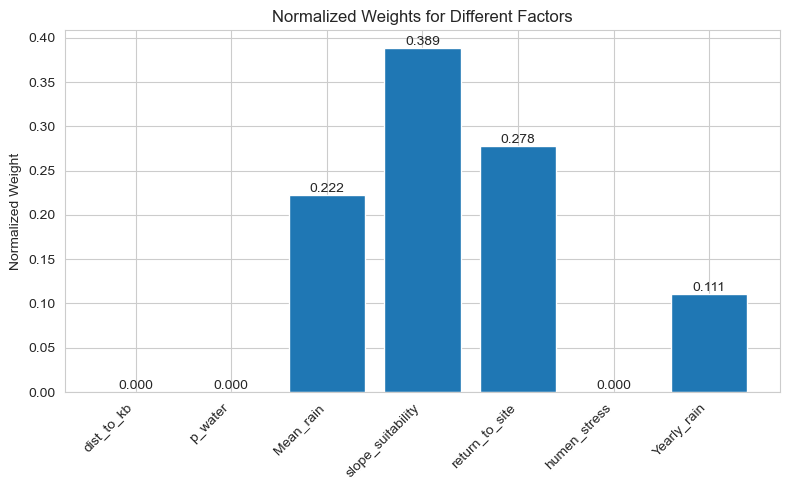

# Environment


```python
#Setup
import arcpy                       # For GIS processing and spatial analysis
from datetime import datetime      # For date and time operations
from scipy.signal import convolve2d
import h5py

from sympy import shape
from tqdm import tqdm
import math
import time
import folium                      # For interactive map creation
import pyproj                      # For coordinate system transformations
import json                        # For JSON data handling
import optuna                      # For hyperparameter optimization
import numpy as np                 # For numerical operations
import os                          # For operating system interactions
import pickle                      # For serializing Python objects
from arcpy.sa import *             # Additional spatial analysis tools
import pandas as pd                # For data manipulation and analysis
import geopandas as gpd            # For geospatial data operations
import fiona                       # For reading/writing spatial data
import mesa                        # For agent-based modeling
from mesa.datacollection import DataCollector  # For collecting model data
import random                      # For random number generation
import copy                        # For creating deep copies of objects
import seaborn as sns              # For statistical data visualization
import matplotlib.pyplot as plt    # For plotting
import matplotlib.animation as animation  # For creating animations
from matplotlib.patches import Ellipse  # For drawing ellipses
from matplotlib import patches     # For drawing shapes
#import mesa_geo as mg             # Commented out GIS extension for Mesa
import pysal                       # For spatial analysis
#from mesa.visualization import SolaraViz, make_plot_component, make_space_component  # For visualization
from sklearn.cluster import DBSCAN  # For density-based clustering
from scipy import linalg           # For linear algebra operations
from shapely.geometry import Point, Polygon  # For geometric operations
from scipy.optimize import minimize  # For optimization
from scipy.ndimage import distance_transform_edt  # For distance calculations
import optuna # For optimization


# Allow overwriting of existing files
arcpy.env.overwriteOutput = True
# Set the workspace (geodatabase) for ArcPy operations
arcpy.env.workspace =  r"D:\itay\Model_2024\Model_2024.gdb"
# Read shapefile containing geographic boundaries
gdf = gpd.read_file(r"D:\itay\HN_ext.shp")

# Extract the coordinates from the geometry to define the study area bounds
coords = []
for geometry in gdf.geometry:
    x, y = geometry.exterior.coords.xy
    coords.extend([min(x), min(y), max(x), max(y)])

# Create the Extent object that defines the geographic boundaries for analysis
extent = arcpy.Extent(*coords)
print(extent)
# Set the extent as the current environment extent
arcpy.env.extent = extent

# Define paths to various input datasets used in the model
param0=r"D:\itay\Model_2024\Model_2024.gdb\Jaxa_israel_Clip_HN"     # Digital elevation model

# Define coordinate system (ITM - Israel Transverse Mercator)
itm_spatial_reference = arcpy.SpatialReference(2039)
arcpy.env.outputCoordinateSystem = itm_spatial_reference

# Set directory paths for outputs and temporary files
base_directory =r"D:\itay\Model_2024\base.gdb"
dump_directory = r"D:\itay\Model_2024\dump.gdb"

# Load rainfall data from CSV file
rain_data=pd.read_csv(r"D:\itay\Model_2024\all_by_S.csv", encoding='Windows-1255')
rp=r"D:\itay\Model_2024\Model_2024.gdb\rain_points_2023"


# Determine cell size for the simulation
# Original cell size
ras = Raster(param0)
orig_cell_size = ras.meanCellWidth  # Assuming square cells, else also check meanCellHeight
print(f"Original cell size: {orig_cell_size} m")

# New cell size (larger for simulation efficiency)
new_cell_size = 250

# Calculate scale factor for resampling
scale_factor = new_cell_size / orig_cell_size

# Original dimensions of the raster
orig_cols = ras.width
orig_rows = ras.height
print(f"Original dimensions: {orig_rows} rows, {orig_cols} columns")

# Calculate new dimensions after resampling
new_cols = 318
new_rows = 280

print(f"New dimensions: {new_rows} rows, {new_cols} columns")
```

    C:\Users\Owner\anaconda3\envs\environment_Model_2025\Lib\site-packages\pysal\explore\segregation\network\network.py:15: UserWarning: You need pandana and urbanaccess to work with segregation's network module
    You can install them with  `pip install urbanaccess pandana` or `conda install -c udst pandana urbanaccess`
      warn(
    C:\Users\Owner\anaconda3\envs\environment_Model_2025\Lib\site-packages\pysal\model\spvcm\abstracts.py:10: UserWarning: The `dill` module is required to use the sqlite backend fully.
      from .sqlite import head_to_sql, start_sql
    

    139558.1607 478519.3236 209577.0318 557944.894200001 NaN NaN NaN NaN
    Original cell size: 12.500000000000004 m
    Original dimensions: 7170 rows, 7494 columns
    New dimensions: 280 rows, 318 columns
    


```python
output_dir = r"D:\itay\ABM"
# Create the filename with path
output_file = os.path.join(output_dir, "yearly_data.h5")
y_output = []
with h5py.File(output_file, 'r') as f:
    # Get number of groups from metadata
    num_groups = f['metadata'].attrs['num_groups']

    # Load each group
    for i in range(num_groups):
        group_arrays = []
        group = f[f'group_{i}']

        # Get arrays in this group
        num_arrays = len(group.keys())

        for j in range(num_arrays):
            # Load array
            array = np.array(group[f'array_{j}'])
            group_arrays.append(array)

        y_output.append(group_arrays)
```


```python
# Open the HDF5 file in read mode
permanent_results=[]
file_path = r"D:\itay\ABM\per_data.h5"
with h5py.File(file_path, 'r') as f:
    # Access metadata
    metadata = f['metadata']
    num_groups = metadata.attrs['num_groups']
    arrays_per_group = metadata.attrs['arrays_per_group']
    array_shape = metadata.attrs['array_shape']

    # Load the arrays from the groups

    for i in range(num_groups):
        group = f[f'group_{i+1}']
        group_arrays = [np.array(group[f'array_{j}']) for j in range(arrays_per_group)]
        permanent_results=group_arrays
```

# Yearly Function


```python
def Yi_params( i, all_outputs):
    """
    This function calculates yearly environmental and anthropogenic factors.
    It tracks resource pressure over time and generates stress zones for modeling.

    Parameters:
    - param10: Initial resource raster for the first year
    - i: Current year index
    - all_outputs: List of outputs from previous years

    Returns:
    - return_ras: Raster showing likelihood of returning to previously used locations
    - yi_hu_stressed_z: Raster showing human-stressed zones
    - past_years: NumPy array of accumulated past impacts
    """

    # Calculate inter-annual pressure on resources
    if i>0:
        # Initialize an empty array with the same shape as the last year's output
        past_years = np.zeros_like(all_outputs[-1])
        past_years = past_years.reshape(new_cols,new_rows)


        # Iterate over all previous years' outputs to calculate cumulative effects
        for idx, output in enumerate(all_outputs):
            # Calculate weights that diminish with time (older years have less influence)
            # Calculate weights that increase with recency
            # Use reversed index to make recent years have more influence
            reversed_idx = len(all_outputs) - 1 - idx  # This makes older years have larger idx values

            decay_factor = 0.7  # Adjust as needed: higher values = faster decay
            weight = (decay_factor ** reversed_idx) * 1  # Standard weight for low impact areas
            weight2 = (decay_factor ** reversed_idx) * 1.5  # Higher weight for high impact areas

            # Apply different weights based on impact intensity
            mask = output < 2           # Areas with low impact
            mask2 = output >= 2         # Areas with high impact

            # Accumulate weighted values for different impact zones
            past_years[mask] += weight * output[mask]
            past_years[mask2] += weight2 * output[mask2]


        radius_cells = 20  # Convert map units to cells 20 cells*250m cell_size=5km radius
        # Create a grid of coordinates
        y, x = np.ogrid[-radius_cells:radius_cells + 1, -radius_cells:radius_cells + 1]
        # Calculate distances from center
        dist = np.sqrt(x * x + y * y)
        # Create inverse distance weights (with power parameter)
        power = 2  # Adjust as needed: higher values = faster decay with distance
        weights = 1.0 / np.power(dist + 1, power)  # Adding 1 to avoid division by zero

        # Normalize weights to sum to 1
        weights_normalized = weights / np.sum(weights)

        # Apply the convolution
        last_year_output = convolve2d(past_years, weights_normalized, mode='same', boundary='fill', fillvalue=0)


    else:
        # For the first year, use the initial parameters provided
        last_year_output = np.zeros((318, 280))
        past_years=np.zeros((318, 280))
        zones=last_year_output

    mean_value = np.mean(last_year_output)

    # Handle different scenarios for stress zone calculation
    if float(mean_value) == 0:
        # If mean value is zero, assign a baseline value of 10 to all zones
        yi_hu_stressed_z = last_year_output + 10
    else:
        # Remove zero values from consideration
        z=np.where(last_year_output==0,np.nan,last_year_output)
        # Define fuzzy membership function (equivalent to FuzzyLinear(2,0))
        def fuzzy_linear(x, max_val, min_val):
            # Scale values between 0 and 1 based on their position in the range
            # Invert the scale since FuzzyLinear(2,0) means higher values have lower membership
            normalized = (max_val - x) / (max_val - min_val)
            # Clip to [0,1] range
            return np.clip(normalized, 0, 1)
        # Apply fuzzy logic to create a gradient of stress levels
        hs_FuzzyAlgorithm = fuzzy_linear(z,2,0)

        yi_hu_stressed_z = hs_FuzzyAlgorithm * 10
        # Fill null values with baseline value of 10
        yi_hu_stressed_z = np.where(np.isnan(yi_hu_stressed_z), 10, yi_hu_stressed_z)


    # Calculate likelihood to return to previously used locations
    return_arr = past_years * 5


    return return_arr, yi_hu_stressed_z, past_years
```

# Agent_init:

## Agent_funcs


```python
#TODO remove uneccesary funcs
# Function to calculate the direction in which the agent will grow or expand.
def grow_direction(agent, r):
    # Get current agent's position (x, y)
    x, y = agent.pos
    pg = []  # List to store potential growth cells and their suitability values

    # Get the neighborhood of the agent with the given radius (r)
    nbr = agent.model.grid.get_neighborhood(agent.pos, moore=True, include_center=False, radius=r)

    # Get the mean environmental value of the agent's current position with the specified radius
    mean_val = env_mean_val(agent.model, agent.pos, r)

    # Iterate through neighboring cells to evaluate suitability
    for cell in nbr:
        xi, yi = cell
        # Get the suitability value of the current cell
        suit_val = agent.model.suitability_raster[to_numpy_y(agent.model, yi), xi]

        # If the cell has a higher suitability than the mean, add it to potential growth list
        if suit_val > mean_val:
            pg.append([(xi, yi), suit_val])

    # Return the list of potential growth cells
    return pg

# Function to calculate the weight for each cell based on its suitability value
def get_weight(agent, element):
    cell, suit_val = element
    # Ensure a minimum weight to avoid division by zero
    return max(suit_val, 0.0001)

# Function to make the agent grow based on its suitability and environment
def grow(model, agent, r):
    # Get agent's current position (x, y)
    x, y = agent.pos

    # Calculate the growth radius as one-third of the specified radius
    grow_rad = int(r / 3)

    # Get the neighboring cells around the agent within the growth radius
    nbr = agent.model.grid.get_neighborhood(agent.pos, moore=True, include_center=False, radius=grow_rad)

    # Get the total manpower available for growth
    tot_mnpw = agent.manpower

    # Calculate the mean environmental value for the agent's position
    mean_val = env_mean_val(model, agent.pos, r)

    # Get potential growth directions for the agent
    pg = grow_direction(agent, grow_rad)

    # Calculate weights for the potential growth cells
    weights = [get_weight(agent, element) for element in pg]

    # Randomly choose growth cells based on weights, with up to 3 cells selected
    if len(pg) > 3:
        ch_cell = random.choices(pg, weights=weights, k=3)
    else:
        ln = len(pg) - 1
        ch_cell = random.choices(pg, weights=weights, k=ln)

    # Apply growth to the selected cells in the target raster
    for i in ch_cell:
        xn, yn = i[0]
        agent.model.target_raster[to_numpy_y(agent.model, yn), xn] += 0.333

    # Decrease surplus and manpower after growth
    agent.surplus -= 1
    agent.manpower -= 1

    # Degrade the environment due to the agent's growth
    env_degrade(agent.model, xn, yn, grow_rad, 0.2, 0.3)

# Function to set the agent's camp (stop moving and establish a position)
def set_camp(agent):
    # Get agent's current position (x, y)
    x, y = agent.pos

    # Decrease surplus and manpower once camp is set
    agent.surplus -= 1
    agent.manpower -= 1

    # Mark the cell in the target raster as the camp location
    agent.model.target_raster[to_numpy_y(agent.model, y), x] += 0.75

# Optimized version of the function to move the agent locally based on environmental conditions
def move_local(model, agent, env_r, search_r, territory):
    """
    Optimized version of move_local that reduces redundant calculations
    and improves performance for frequent calls.

    Args:
        model: The model instance
        agent: The agent to move
        env_r: Environment check radius
        search_r: Search radius for new positions
        territory: Set/list of valid territory positions

    Returns:
        New position tuple if move is possible, False otherwise
    """
    # Get current position of the agent
    current_pos = agent.pos

    # Calculate the mean environmental value for the current position
    mean_env_value = env_mean_val(model, current_pos, env_r)

    # If the environment value is low, attempt to move
    if mean_env_value <= 5:
        # Get neighboring cells around the agent for movement options
        near_env = model.grid.get_neighborhood(current_pos, moore=True, include_center=False, radius=search_r)

        # Convert territory to a set for faster lookups
        territory_set = set(territory)

        # Pre-calculate occupied positions for faster lookup
        occupied_positions = set()
        for pos in near_env:
            if model.grid.get_cell_list_contents(pos):
                occupied_positions.add(pos)

        # Calculate a target threshold for movement
        target_threshold = mean_env_value + 0.5

        # Pre-calculate valid positions for movement based on environmental suitability
        valid_positions = []
        for pos in near_env:
            if (pos in territory_set and
                pos not in occupied_positions and
                model.place_raster[to_numpy_y(model, pos[1]), pos[0]] == 1):  # Check if position is allowed
                pos_env_value = env_mean_val(model, pos, env_r)
                if pos_env_value > target_threshold:
                    valid_positions.append(pos)

        # Choose a random valid position for the agent to move to
        if valid_positions:
            return random.choice(valid_positions)

    # Return False if no valid position is found
    return False

# Function to calculate the number of agents based on total area and carrying capacity
def Num_agents():
    total_area_sq_km = 3251.54  # The Negev Highlands (model 2024)

    # Calculate the maximum number of agents that the area can support
    Max_carry_agents = total_area_sq_km / 18  # 9 km² per member agent

    # Calculate the number of agents based on the carrying capacity
    carry_agents = Max_carry_agents / 20  # Max_carry_agents * 0.5

    # Return the number of agents as an integer
    return int(np.floor(carry_agents))

# Function to calculate the pasture suitability value based on environmental factors
def pasture_val(model, current_pos, r):
    # Get the neighborhood of the current position
    nbr = model.grid.get_neighborhood(current_pos, moore=True, include_center=False, radius=r)

    # Filter out any cells that are out of bounds or outside the region of interest
    nbr = [cell for cell in nbr if not model.grid.out_of_bounds(cell) and cell[0] < 280]

    # Avoid division by zero in the stress raster by replacing zeros with a small value
    stress_safe = np.where(model.stress_ras == 0, 0.01, model.stress_ras)

    # Calculate the inverse stress factor (higher stress means less suitable)
    inverse_stress = 1 / (stress_safe / 10)

    # Cap the stress value to a maximum of 9
    capped_stress = np.minimum((inverse_stress - 1), 9)

    # Calculate the final vegetation map by adjusting for stress
    veg_map = np.maximum((model.veg_ras * (1 - (capped_stress * 0.1))), 0)

    # Collect the environmental values of neighboring cells
    env_values = [
        veg_map[to_numpy_y(model, pos[1]), np.clip(pos[0], 0, 279)]  # Vegetation suitability
        for pos in nbr
    ]

    # Calculate the mean environmental value of the neighborhood
    tot_env_value = sum(env_values)

    # Return the mean environmental value
    return tot_env_value

# Function to resample a raster to a new resolution (cell size)
def resample(raster, path):
    # Resample the raster to the desired cell size using Bilinear resampling
    arcpy.management.Resample(in_raster=raster, out_raster=path, cell_size=250, resampling_type="Bilinear")

    # Return the resampled raster object
    resampled_raster_obj = arcpy.Raster(path)
    return resampled_raster_obj
```

## Agent class


```python
class Household_Agent(mesa.Agent):
    """
    Represents a household unit in the model.
    Each household manages resources, manpower, territory, and enclosures over time.

    Attributes:
    ----------
    flock_head : int
        Represents the livestock units available to the household.
    surplus : int
        Represents the resource surplus of the household.
    manpower : int
        The number of humans in the household, representing its workforce or
        population.
    territory : list
        The territory currently occupied by the household. Can be used to
        track spatial information like coordinates or grid cells.
    memory : list
    """

    def __init__(self, model, threshold, manpower=None, surplus=None, flock_head=None):
        super().__init__(model)  # Initialize the agent within the Mesa framework

        # Core attributes of the household
        if flock_head is None:
            self.flock_head = 0
            for _ in range(10):
                # ~18 livestock units per person, ~6 people per family, adapted from finkelstein and rosen
                flock_n = np.floor(random.gauss(105, 15))
                self.flock_head += flock_n
        else:
            self.flock_head = flock_head

        if manpower is None:
            self.manpower = max(35, np.floor(self.flock_head / 20))
        else:
            self.manpower = manpower

        if surplus is None:
            self.surplus = 0
        else:
            self.surplus = surplus
        self.territory = None  # Area claimed by the household
        self.memory = []  # Record of past encampments
        self.enc_memory = []  # Record of past enclosures
        #self.members = members  # List of members
        self.threshold = threshold  # Threshold for resource-based decisions =2
        self.own_suitability_raster=None


    def step(self):
        """Defines the actions the household takes in a simulation step."""
        # Update household's total surplus by summing member surpluses
        self.calc_surplus()

        # Simplified scenario system (bad, neutral, good) integrated with communal costs
        scenario_roll = random.random()

        # Base communal cost calculation
        base_communal_cost = math.ceil(self.manpower * 0.3)

        if scenario_roll < 0.25:  # Bad scenario (25% chance)
            # Higher costs due to disease, conflict, harsh weather, etc.
            scenario_multiplier = random.uniform(1.3, 1.6)
            communal_cost = math.ceil(base_communal_cost * scenario_multiplier)

            # Bad scenarios can also affect livestock
            if random.random() < 0.6:  # 60% chance of affecting livestock
                self.flock_head = math.floor(self.flock_head * (1 - random.uniform(0.05, 0.12)))

        elif scenario_roll < 0.75:  # Neutral scenario (50% chance)
            # Normal costs
            scenario_multiplier = random.uniform(0.95, 1.05)
            communal_cost = math.ceil(base_communal_cost * scenario_multiplier)

        else:  # Good scenario (25% chance)
            # Lower costs due to favorable conditions, gifts, good trade
            scenario_multiplier = random.uniform(0.7, 0.9)
            communal_cost = math.ceil(base_communal_cost * scenario_multiplier)

            # Good scenarios might bring additional benefits
            if random.random() < 0.5:  # 50% chance of bonus
                # Small surplus boost or manpower increase
                if random.random() < 0.7:
                    self.surplus += base_communal_cost * random.uniform(0.1, 0.3)
                else:
                    self.manpower += random.randint(1, 2)

        # Apply communal costs with more impact for larger surpluses
        # As surplus grows, costs increase more than linearly
        if self.surplus > 50:
            # Additional social obligations for wealthy households (feasts, gifts, etc.)
            wealth_factor = 1 + (self.surplus - 50) / 200  # Increases with surplus
            communal_cost = math.ceil(communal_cost * wealth_factor)

        # Apply the communal cost
        if self.surplus > communal_cost:
            self.surplus -= communal_cost
        else:
            # If not enough surplus, reduce what we can and potentially impact other resources
            self.surplus = 0
            deficit = communal_cost - self.surplus

            # Deficit has some impact on manpower or flock
            if random.random() < 0.3:
                self.manpower = max(1, self.manpower - math.ceil(deficit / 20))
            else:
                self.flock_head = max(50, self.flock_head - deficit)
        self.manpower-=10 #for yearly movement
        herders=(self.flock_head//75)
        self.manpower-=herders #manpower for herding
        # Check for an existing enclosure within the territory
        existing_enclosure = self.find_recent_enclosure()

        # Environmental quality assessment
        current_env_value = env_mean_val(self.model, self.pos, 20)
        env_quality = current_env_value / 10.0  # Normalized to 0-1 range
        # Calculate surplus ratio as prosperity indicator
        surplus_ratio = self.surplus / (self.manpower+10+herders)
        # Calculate household prosperity index
        #print('env_qulity:',env_quality, 'surplus_ratio:', surplus_ratio)
        #prosperity_index = (surplus_ratio / (self.threshold * 2)) * env_quality
        prosperity_index = surplus_ratio  * env_quality
        is_prosperous = prosperity_index > 0.7
        if is_prosperous:
            # Only proceed with enclosure-related actions if manpower and surplus meet thresholds
            if self.manpower >= 15 and self.surplus >= self.threshold:
                if existing_enclosure:

                    xn, yn = existing_enclosure

                    # Basic cost for reuse
                    manpower_cost = 10
                    surplus_cost = 6

                    #print(f"Enclosure reused by agent: {self.unique_id}, prosperity: {prosperity_index:.2f}")

                    # Now reduce household resources
                    self.manpower = max(self.manpower - manpower_cost, 0)
                    self.surplus = max(self.surplus - surplus_cost, 0)
                    self.model.target_raster[to_numpy_y(self.model, yn), xn] += 1
                    self.model.enclosures.append([existing_enclosure, self.model.year, self])
                    self.enc_memory.append([existing_enclosure, self.model.year])
                    self.manpower += manpower_cost * 0.9  # Partial recovery of workforce

                elif prosperity_index>0.8 and self.manpower >= 40 and self.surplus >= self.threshold * 1.5:
                    # Prosperous households can build new enclosures
                    enc_pos = self.build_enclosure(self.territory, current_env_value)
                    xn, yn = enc_pos

                    # Higher investment by prosperous households
                    manpower_cost = 20
                    surplus_cost = 25

                    # If not enough surplus, convert flock to surplus (emergency measure)
                    if self.surplus < surplus_cost:
                        surplus_needed = surplus_cost - self.surplus
                        flock_needed_for_surplus = surplus_needed * 3
                        manpower_reserve = self.manpower * 20
                        available_flock = max(0, self.flock_head - manpower_reserve)
                        flock_to_convert = min(available_flock, flock_needed_for_surplus)

                        if flock_to_convert > 0:
                            self.flock_head -= flock_to_convert
                            self.surplus += flock_to_convert / 3

                    #print(f"New enclosure built by: {self.unique_id}, prosperity: {prosperity_index:.2f}")

                    # More investment leads to better quality enclosures
                    enclosure_quality = 2 + (prosperity_index * 2)  # Higher prosperity = more activity

                    self.manpower = max(self.manpower - manpower_cost, 0)
                    self.surplus = max(self.surplus - surplus_cost, 0)
                    self.model.target_raster[to_numpy_y(self.model, yn), xn] += enclosure_quality
                    self.model.enclosures.append([enc_pos, self.model.year, self])
                    self.enc_memory.append([enc_pos, self.model.year])
                    self.manpower += manpower_cost * 0.9  # Partial recovery of workforce
        # Handle survival crisis if surplus is too low
        if self.surplus < 10:
            survived = self.handle_survival_crisis(threshold=10)
            if not survived:
                self.remove()
                return  # Exit the step method if household is removed
        # Update flock size based on environmental conditions
        self.update_flock_size()

        # Adjust manpower based on random chance
        self.manpower = max(1, self.manpower + 10)
        self.manpower+=herders #manpower for herding
        if random.uniform(0, 1) > 0.8:
            self.manpower += math.ceil(5*random.uniform(0,1))
        if self.manpower > 35 and random.uniform(0, 1) > 0.8:
            self.manpower -= math.ceil(5*random.uniform(0,1))
        # Surplus-dependent manpower bonuses
        if self.surplus > 100:
            self.manpower += min(5, self.surplus // 20)
        # Surplus decay over time
        if self.surplus > 50:
            base_decay_rate = 0.05  # 5% base decay
            # Increased decay rate for higher surplus
            scaling_factor = 0.003 * (self.surplus - 50)
            decay_rate = min(0.4, base_decay_rate + scaling_factor)  # Cap at 40%
            decay_amount = self.surplus * decay_rate
            self.surplus -= decay_amount

    def year_initiation(self):
        """Initial setup for the household at the start of the year."""
        self.own_suitability_raster=None
        self.memory = [i for i in self.memory if (self.model.year - i[2]) * random.random() < 5]


        mesa_x, mesa_y = place_household(self.model, self, self.model.suitability_raster)
        self.model.grid.place_agent(self, (mesa_x, mesa_y))
         # Check environmental conditions
        current_env_value = env_mean_val(self.model, self.pos, 20)

        # Calculate territory radius based on environmental conditions
        base_radius = 20  # Default radius
        # Expand territory in poor environmental conditions
        if current_env_value < 3.5:  # Poor conditions
            territory_radius = base_radius + 10  # Significantly larger territory
        elif current_env_value < 5.0:  # Moderate conditions
            territory_radius = base_radius + 5   # Somewhat larger territory
        else:  # Good conditions
            territory_radius = base_radius       # Standard territory size
        self.territory = self.model.grid.get_neighborhood((mesa_x, mesa_y), moore=True, include_center=True, radius=territory_radius)
        self.model.territories.append(self.territory)
        set_camp(self)

        for _ in range (9):
            selected_cell = place_members(self.model, self, self.territory)  # Place member
            env_degrade(self.model, selected_cell[0], selected_cell[1], 11, 0.3, 0.5)  # Simulate member degradation
            self.memory.append([selected_cell, env_mean_val(self.model, selected_cell, 5), self.model.year])
            self.model.target_raster[to_numpy_y(self.model, selected_cell[1]), selected_cell[0]] += 0.5

        env_degrade(self.model, mesa_x, mesa_y, territory_radius, 0.5, 0.9)
        self.memory.append([self.pos, env_mean_val(self.model, self.pos, territory_radius), self.model.year])
    def calc_surplus(self):
        """
        Calculates resource surplus based on manpower, herd size, agricultural potential,
        and environmental stress conditions, ensuring realistic consumption and limits.
        """
        # Reset surplus at beginning of calculation to avoid accumulation
        # This is a major change - calculate actual surplus each time instead of incrementing
        current_surplus = self.surplus
        self.surplus = 0

        # Check agricultural potential in territory
        ag_values = []
        for cell in self.territory:
            x, y = cell
            ag_values.append(self.model.ag_ras[to_numpy_y(self.model, y), x])

        # Calculate mean agricultural value in territory (0-10 scale)
        mean_ag_value = sum(ag_values) / len(ag_values) if ag_values else 0

        # Reduce livestock need based on agricultural potential
        ag_benefit = min(0.4, mean_ag_value * 0.04)  # Up to 40% reduction

        # Adjust base livestock need according to agricultural potential
        base_need_per_person = 18 * (1 - ag_benefit)
        subsistence_need = self.manpower * base_need_per_person

        # Calculate environmental carrying capacity using pasture_val
        env_value = pasture_val(self.model, self.pos, 25)
        neighborhood = self.model.grid.get_neighborhood(self.pos, moore=True, include_center=False, radius=25)
        neighborhood_size = len(neighborhood)
        avg_env_value = env_value / neighborhood_size if neighborhood_size > 0 else 0

        # Medium quality (5 on 0-10 scale) with 250m*250m cells (0.0625 sq km)
        # Each cell at medium quality supports 1.125 goats
        quality_factor = avg_env_value / 5.0
        carrying_capacity = neighborhood_size * 1.125 * quality_factor

        # Calculate stress ratio based on carrying capacity
        stress_ratio = max(0, 1 - (carrying_capacity / self.flock_head)) if self.flock_head > 0 else 0

        # Calculate costs with environmental influence
        maintenance_cost = self.flock_head * 0.05  # Base maintenance cost
        stress_cost = self.flock_head * stress_ratio * 0.15  # Higher penalty for overstocking

        total_cost = math.ceil(subsistence_need + maintenance_cost + stress_cost)

        # Production is excess livestock after essential needs are covered
        excess_livestock = max(0, self.flock_head - total_cost)

        # Convert excess livestock to surplus value
        # Based on the Gunther et al. 2021 and Dhal and Hjort 1976:96 :
        # Consider age/sex structure of the excess livestock
        juvenile_males_ratio = 0.148  # Approximation based on herd demographics in d&h
        adult_females_ratio = 0.579
        adult_males_ratio = 0.088
        juvenile_females_ratio = 0.185

        # Different surplus value per type (reflecting their value as described in Gunther et al. 2021)
        juvenile_males_value = 0.3  # First to be culled, lowest value
        adult_females_value = 0.2   # Breeding stock, rarely culled
        adult_males_value = 0.4     # Higher meat value but less reproductive value
        juvenile_females_value = 0.25 # Future breeding stock

        # Calculate surplus from different components of the herd
        surplus_from_juvenile_males = excess_livestock * juvenile_males_ratio * juvenile_males_value
        surplus_from_adult_males = excess_livestock * adult_males_ratio * adult_males_value
        surplus_from_adult_females = excess_livestock * adult_females_ratio * adult_females_value
        surplus_from_juvenile_females = excess_livestock * juvenile_females_ratio * juvenile_females_value

        # Prioritize culling juvenile males first, then adult males, then others
        culling_priority = [
            (juvenile_males_ratio, surplus_from_juvenile_males),
            (adult_males_ratio, surplus_from_adult_males),
            (adult_females_ratio, surplus_from_adult_females),
            (juvenile_females_ratio, surplus_from_juvenile_females)
        ]

        total_surplus = 0
        remaining_excess = excess_livestock

        # Use the culling priority to determine surplus generation
        for ratio, value in culling_priority:
            # How many of this type can be culled
            available = math.floor(self.flock_head * ratio)
            to_cull = min(remaining_excess, available)

            if to_cull > 0:
                # Calculate value based on type-specific value
                type_value_per_head = value / (excess_livestock * ratio) if excess_livestock * ratio > 0 else 0
                total_surplus += to_cull * type_value_per_head
                remaining_excess -= to_cull

            if remaining_excess <= 0:
                break

        # Add resource decay - resources spoil or degrade over time
        decay_rate = 0.3  # 30% of surplus decays each time step
        preserved_surplus = current_surplus * (1 - decay_rate)

        # Additional basic consumption - households use surplus for non-essential needs
        consumption_per_person = 0.8  # Each person consumes some surplus for quality of life
        additional_consumption = self.manpower * consumption_per_person

        # Calculate final surplus
        final_surplus = preserved_surplus + total_surplus - additional_consumption

        # Cap the maximum surplus a household can maintain
        max_surplus_cap = 200 + (self.manpower * 5)  # Base cap plus additional per person
        self.surplus = min(max(0, final_surplus), max_surplus_cap)
    # Extract this from your step method and replace with the following:
    def update_flock_size(self):
        """
        Updates flock size based on environmental conditions and stress levels.
        Should be called from the step method.
        """
        # Calculate environmental value
        env_value = pasture_val(self.model, self.pos, 30)

         # Get the neighborhood cells
        neighborhood = self.model.grid.get_neighborhood(self.pos, moore=True, include_center=False, radius=30)
        neighborhood_size = len(neighborhood)

        # Calculate average environmental value per cell
        avg_env_value = env_value / neighborhood_size if neighborhood_size > 0 else 0

        # Environmental quality is on a 0-10 scale
        # Medium quality (5 on 0-10 scale) means 1 sq km can support ~ 18 goats
        # Each cell is 0.0625 sq km (250m × 250m)
        # So a medium quality cell (5) supports 18 * 0.0625 = 1.125 goats

        # Scale based on actual quality
        # If avg_env_value is 10 (max quality), it can support twice as many goats as medium quality
        # If avg_env_value is 0, it can support no goats
        quality_factor = avg_env_value / 5.0  # Ratio compared to medium quality

        # Each cell's carrying capacity
        goats_per_cell = 1.125 * quality_factor

        # Total carrying capacity for the neighborhood
        carrying_capacity = goats_per_cell * neighborhood_size

        # Calculate resource-to-livestock ratio
        ratio = carrying_capacity / self.flock_head if self.flock_head > 0 else 2.0

        # Get average stress level in territory
        stress_values = []
        for cell in self.territory:
            x, y = cell
            numpy_y = to_numpy_y(self.model, y)
            if 0 <= numpy_y < self.model.stress_ras.shape[0] and 0 <= x < self.model.stress_ras.shape[1]:
                stress_values.append(self.model.stress_ras[numpy_y, x])

        avg_stress = sum(stress_values) / len(stress_values) if stress_values else 0
        stress_factor = 1 - min(0.5, avg_stress / 20)  # Higher stress reduces growth
        # Calculate small flock factor - smaller flocks get enhanced recovery
        small_flock_factor = 1.0
        if self.flock_head < 500:
            # Enhanced recovery factor increases as flock size decreases
            small_flock_factor = 2.0 - (self.flock_head / 500)  # Scales from 2.0 to 1.0
        # Adjust flock size based on resource ratio and stress
        if ratio > 1.1:  # More resources than needed
            # Growth factor diminishes with large herds and high stress
            max_growth_rate = 0.1 * stress_factor* small_flock_factor
            # Apply diminishing returns as flock size increases
            diminishing_factor = max(0.3, 1 - (self.flock_head / 1000))

            # Calculate actual growth rate with randomization
            growth_rate = max_growth_rate * diminishing_factor * min(ratio, 2.0) * random.uniform(0.7, 1.3)

            # Apply growth with a cap based on carrying capacity
            max_sustainable = carrying_capacity * 1.2  # Allow some overshoot
            growth_amount = min(
                self.flock_head * growth_rate,  # Normal growth
                max_sustainable - self.flock_head  # Cap to sustainable level
            )

            self.flock_head = np.floor(self.flock_head + max(0, growth_amount))

        elif ratio < 0.9:  # Not enough resources
            # Higher decline rates when resources are scarce
            base_decline = 0.1 * (1 + (0.9 - ratio) * 2)
            # More severe decline with higher stress
            stress_impact = 1 + (avg_stress / 20)
            # Reduced decline for small flocks - emergency preservation instinct
            if self.flock_head < 100:
                # Reduce decline rate for small flocks to give them a chance to recover
                base_decline *= max(0.4, self.flock_head / 100)  # Scales from 0.4 to 1.0
            # Calculate actual decline rate with randomization
            decline_rate = base_decline * stress_impact * random.uniform(0.8, 1.2)

            # Apply decline
            self.flock_head = np.floor(self.flock_head * (1 - decline_rate))

    def find_recent_enclosure(self):
        """Finds the most recent usable enclosure within the households territory."""
        recent_enclosures = []
        current_year = self.model.year

        # Prioritize household's own enclosures
        for enc in self.enc_memory:
            if enc[0] in self.territory and (current_year - enc[1]) < 20:
                score = 20 - (current_year - enc[1])  # Newer enclosures have higher priority
                recent_enclosures.append((enc[0], score))

        # Check all enclosures in the model
        for enc in self.model.enclosures:
            if enc[0] in self.territory and (current_year - enc[1]) < 15 and enc[1]!=current_year:
                score = (15 - (current_year - enc[1])) * 0.8  # Lower priority than own enclosures
                recent_enclosures.append((enc[0], score))

        if not recent_enclosures:
            return None

        # Adjust scores with environmental factors
        enhanced_scores = []
        for pos, score in recent_enclosures:
            x, y = pos
            veg_value = self.model.veg_ras[to_numpy_y(self.model, y), x]
            ag_value = self.model.ag_ras[to_numpy_y(self.model, y), x]
            env_factor = 1.0 + ((veg_value * 0.02) + (ag_value * 0.02))
            final_score = score * env_factor * random.uniform(0.8, 1.2)
            enhanced_scores.append((pos, final_score))

        if not enhanced_scores:
            return None

        # Select an enclosure probabilistically based on weighted scores
        selected_idx = random.choices(range(len(enhanced_scores)), weights=[s[1] for s in enhanced_scores], k=1)[0]
        return enhanced_scores[selected_idx][0]
    def handle_survival_crisis(self, threshold=10):
        """
        Handles survival conditions when surplus falls below a threshold by strategically
        culling livestock based on demographic categories.

        Parameters:
        ----------
        threshold : int
            The surplus threshold below which survival measures are triggered

        Returns:
        -------
        bool
            True if the household survives, False if it should be removed
        """
        if self.surplus >= threshold:
            return True

        emergency_surplus = 0

        # Calculate approximate herd composition based on realistic demographics (dhal and hjort)
        juvenile_males = math.floor(self.flock_head *  0.148)
        adult_males = math.floor(self.flock_head * 0.088)
        juvenile_females = math.floor(self.flock_head * 0.185)
        adult_females = math.floor(self.flock_head * 0.579)

        # First strategy: Sacrifice juvenile males
        juvenile_males_to_cull = min(juvenile_males, max(0, math.ceil((100 - self.surplus) / 0.3)))
        if juvenile_males_to_cull > 0:
            self.flock_head -= juvenile_males_to_cull
            emergency_surplus += juvenile_males_to_cull * 0.3

        # If still in crisis, sacrifice some adult males
        if self.surplus + emergency_surplus < 50 and adult_males > 0:
            adult_males_to_cull = min(adult_males, max(0, math.ceil((50 - self.surplus - emergency_surplus) / 0.4)))
            self.flock_head -= adult_males_to_cull
            emergency_surplus += adult_males_to_cull * 0.4

        # Last resort: Start culling juvenile females
        if self.surplus + emergency_surplus < 25 and juvenile_females > 0:
            max_juvenile_females_to_cull = math.floor(juvenile_females * 0.8)
            juvenile_females_to_cull = min(max_juvenile_females_to_cull,
                                        max(0, math.ceil((25 - self.surplus - emergency_surplus) / 0.25)))
            self.flock_head -= juvenile_females_to_cull
            emergency_surplus += juvenile_females_to_cull * 0.25

        # Absolute dire emergency: Begin culling some adult females
        if self.surplus + emergency_surplus < 10 and adult_females > 0:
            max_adult_females_to_cull = math.floor(adult_females * 0.4)
            adult_females_to_cull = min(max_adult_females_to_cull,
                                    max(0, math.ceil((10 - self.surplus - emergency_surplus) / 0.2)))
            self.flock_head -= adult_females_to_cull
            emergency_surplus += adult_females_to_cull * 0.2
            self.in_severe_crisis = True
        else:
            self.in_severe_crisis = False

        # Add the emergency surplus to the household's resources
        self.surplus += emergency_surplus

        # Check if the household can survive
        if self.surplus < 0 or self.flock_head < 15 or self.manpower <= 0:
            #print('Removing agent', self, 'surplus:', self.surplus, 'flock_head:', self.flock_head, 'manpower:', self.manpower)
            # Store agent resources for new agent creation
            leftover_resources = {
                'manpower': max(1, self.manpower),
                'surplus': max(0, self.surplus),
                'flock_head': max(0, self.flock_head)
            }
            # Add to list of scheduled new agents
            if not hasattr(self.model, 'scheduled_new_agents'):
                self.model.scheduled_new_agents = []

            self.model.scheduled_new_agents.append(leftover_resources)
            return False  # Household should be removed

        # Ensure minimum manpower
        self.manpower = max(6, self.manpower)

        # If in severe crisis mode, adjust behavior
        if self.in_severe_crisis:
            # Reduce territory range for conservative grazing
            self.territory = self.model.grid.get_neighborhood(self.pos, moore=True, include_center=True, radius=15)

        return True  # Household survives
    def build_enclosure(self, nbr, mean_val):
        """
        Selects the best cell for building an enclosure using probabilistic methods
        that take into account environmental factors and existing structures.
        """
        bst_cells = []

        # First gather all possible options with their base scores

        # Recent own enclosures with higher weight
        for enc in self.enc_memory:
            if enc[0] in nbr:
                age = self.model.year - enc[1]
                xi, yi = enc[0]

                # Get environmental values
                veg_value = self.model.veg_ras[to_numpy_y(self.model, yi), xi]
                ag_value = self.model.ag_ras[to_numpy_y(self.model, yi), xi]
                suit_val = self.model.suitability_raster[to_numpy_y(self.model, yi), xi]

                # Calculate base score
                if age < 15:  # Recent enclosures
                    base_score = 20 - age
                else:  # Older enclosures
                    base_score = 5 + (20 - min(age, 20))/3

                # Apply environmental factors
                env_factor = 1.0 + (veg_value * 0.02) + (ag_value * 0.02) + (suit_val * 0.02)
                total_score = base_score * env_factor

                # Apply ownership bias (own enclosures are preferred)
                ownership_bias = 1.5
                final_score = total_score * ownership_bias

                # Add randomization for probabilistic selection (±10%)
                random_factor = random.uniform(0.9, 1.1)
                bst_cells.append([enc[0], final_score * random_factor])

        # Consider other enclosures in the simulation
        for enc_data in self.model.enclosures:
            enc_pos, enc_year, enc_owner = enc_data
            if enc_pos in nbr and enc_pos not in [e[0] for e in self.enc_memory]:
                age = self.model.year - enc_year
                if age > 15:  # Only consider relatively old enclosures
                    xi, yi = enc_pos

                    # Get environmental values
                    veg_value = self.model.veg_ras[to_numpy_y(self.model, yi), xi]
                    ag_value = self.model.ag_ras[to_numpy_y(self.model, yi), xi]
                    suit_val = self.model.suitability_raster[to_numpy_y(self.model, yi), xi]

                    # Calculate base score
                    base_score = 10 - (age/2)

                    # Apply environmental factors
                    env_factor = 1.0 + (veg_value * 0.02) + (ag_value * 0.02) + (suit_val * 0.02)
                    final_score = base_score * env_factor

                    # Add randomization (±30%)
                    random_factor = random.uniform(0.7, 1.3)
                    bst_cells.append([enc_pos, final_score * random_factor])

        # Check if reusing is a viable strategy
        has_reuse_candidates = False
        if bst_cells:
            average_score = sum(cell[1] for cell in bst_cells) / len(bst_cells)
            if average_score > 8:  # Threshold for considering reuse as viable
                has_reuse_candidates = True

        if self.model.enclosures:
            # Consider new locations only if no good reuse candidates or by random chance
            should_consider_new = not has_reuse_candidates or random.random() > 0.7
        else:
            should_consider_new = random.random() > 0.4

        if should_consider_new:
            # Consider other cells for new enclosures
            for cell in nbr:
                # Skip cells that already have enclosures recently built by others
                if any(e[0] == cell and (self.model.year - e[1]) < 25 for e in self.model.enclosures):
                    continue

                xi, yi = cell

                # Get comprehensive environmental assessment
                veg_value = self.model.veg_ras[to_numpy_y(self.model, yi), xi]
                ag_value = self.model.ag_ras[to_numpy_y(self.model, yi), xi]
                suit_val = self.model.suitability_raster[to_numpy_y(self.model, yi), xi]

                # Calculate combined environmental score
                env_score = (suit_val * 0.7) + (veg_value * 0.15) + (ag_value * 0.15)

                # Only consider locations with good environmental values
                if env_score > mean_val + 1:
                    # New locations get a lower base score
                    base_score = env_score * 0.8

                    # Add randomization (±25%)
                    random_factor = random.uniform(0.75, 1.25)
                    bst_cells.append([cell, base_score * random_factor])

        # If no suitable cells were found, return the agent's current position
        if not bst_cells:
            return self.pos
        else:
            # Use weighted random selection
            weights = [max(0, cell[1]) for cell in bst_cells]  # Ensure weights are non-negative
            total_weight = sum(weights)

            if total_weight > 0:
                # Normalize weights
                normalized_weights = [w / total_weight for w in weights]
                selected_idx = random.choices(range(len(bst_cells)), weights=normalized_weights, k=1)[0]
                selected_cell = bst_cells[selected_idx][0]
            else:
                # Fallback if all weights are zero (or there are no cells)
                if bst_cells:
                    # Select randomly without weights if weights are all zero
                    selected_idx = random.randint(0, len(bst_cells) - 1)
                    selected_cell = bst_cells[selected_idx][0]

        return selected_cell
    def update_own_suitability_raster(self):
        if self.own_suitability_raster is None:
            # Create a copy of the suitability raster to avoid modifying the original
            self.own_suitability_raster = self.model.suitability_raster.copy()

        # Adjust raster based on the agent's territory
        if self.territory:
            # Create a binary mask of the territory
            territory_mask = np.zeros_like(self.own_suitability_raster, dtype=bool)
            for x, y in self.territory:
                numpy_y = to_numpy_y(self.model, y)
                territory_mask[numpy_y, x] = True

            # Calculate the distance transform (distance from territory boundaries)
            distances = distance_transform_edt(~territory_mask)

            # Apply a distance-based adjustment to the suitability raster
            adjustment = np.where(distances <= 10, 1 / (distances + 1), 0)
            self.own_suitability_raster += adjustment

        # Adjust raster based on the agent's memory of past locations
        if self.memory:
            for (x, y), value, year in self.memory:
                numpy_cell = (to_numpy_y(self.model, y), x)
                diff_y=self.model.year - year
                if diff_y==0:
                    self.own_suitability_raster[numpy_cell] -=0.5
                else:
                    time_factor = 1 / (diff_y)  # Weight decreases with time
                    if value >= 5:
                        # Increase suitability for positive memories
                        self.own_suitability_raster[numpy_cell] += value * time_factor * 0.2
                    elif value > 0:
                        # Decrease suitability for negative memories
                        self.own_suitability_raster[numpy_cell] -= (1 / value) * time_factor * 0.2

```

# Model_init

## Model_funcs


```python
# Convert Mesa y-coordinate to NumPy y-coordinate (Mesa's y-axis is inverted)
def to_numpy_y(model, mesa_y):
    numpy_y = np.clip(model.grid.height - mesa_y - 1, 0, model.grid.height - 1)
    return numpy_y

# Calculate the mean environmental suitability value in a neighborhood
def env_mean_val(model, current_pos, r):
    # Get neighborhood cells within radius r
    nbr = model.grid.get_neighborhood(
        current_pos, moore=True, include_center=False, radius=r
    )
    # Filter out-of-bounds cells and cells beyond x=280
    nbr = [cell for cell in nbr if not model.grid.out_of_bounds(cell) and cell[0] < 280]
    # Extract suitability values for each cell in the neighborhood
    env_values = [
        model.suitability_raster[to_numpy_y(model, pos[1]), np.clip(pos[0], 0, 279)]
        for pos in nbr
    ]
    # Calculate the mean suitability value
    mean_env_value = sum(env_values) / len(env_values)
    return mean_env_value

# Calculate the carrying capacity of the environment based on suitability and population needs
def calculate_carrying_capacity(model, suitability_raster, population, needs):
    """Calculates the carrying capacity based on average suitability."""
    max_agent_resources = population * needs  # Total resources needed by the population
    carrying_capacity = np.sum(suitability_raster) / max_agent_resources  # Total suitability divided by needs
    return int(np.floor(carrying_capacity))  # Round down to the nearest integer

# Evaluate the suitability of a neighborhood for placing a household
def eval_neighborhood(model, x, y, household, radius, n):
    # Get neighborhood cells within the given radius
    nbr = model.grid.get_neighborhood((x, y), moore=True, include_center=False, radius=radius)
    # Count non-empty cells in the neighborhood
    for cell in nbr:
        if model.grid.is_cell_empty(cell) is False:
            n += 1
    # Convert y-coordinate to NumPy format
    numpy_y = model.suitability_raster.shape[0] - y - 1
    # Define boundaries for the subarray (neighborhood area)
    start_x = max(0, x - radius)
    stop_x = min(model.suitability_raster.shape[1], x + radius + 1)
    start_numpy_y = max(0, numpy_y - radius)
    stop_numpy_y = min(model.suitability_raster.shape[0], numpy_y + radius + 1)
    # Extract subarrays for suitability and return rasters
    subarray = model.suitability_raster[start_numpy_y:stop_numpy_y, start_x:stop_x]
    ret_array = model.return_raster[start_numpy_y:stop_numpy_y, start_x:stop_x]
    # Adjust suitability values if return raster values are >= 2
    if np.any(ret_array >= 2):
        mask2 = ret_array >= 2
        subarray[mask2] += ret_array[mask2]
    # Calculate the carrying capacity for the neighborhood
    eval_env = calculate_carrying_capacity(model, subarray, household.manpower, n)
    return eval_env

# Check if a neighborhood overlaps with another household's territory
def overlap_territory(model, current_agent, nbr):
    l = []
    Overlap = 0
    # Iterate through all households except the current one
    for household in model.agents_by_type[Household_Agent]:
        if household != current_agent and household.territory != None:
            # Check if any cell in the neighborhood overlaps with the household's territory
            if any(cell in household.territory for cell in nbr):
                Overlap += 1
            else:
                Overlap += 0
            # Calculate the overlap ratio
            overlap_state = Overlap / (len(nbr))
            # Return True if overlap exceeds 25%
            if overlap_state > 0.25:
                return True
            else:
                return False

# Place a household agent in the environment based on suitability and memory
def place_household(model, current_agent, suitability_raster):
    # Create a copy of the suitability raster to avoid modifying the original
    current_agent.update_own_suitability_raster()
    # Generate probability weights for placement
    current_agent.own_suitability_raster[current_agent.own_suitability_raster < 0]=0
    prob_ras=model.place_raster * current_agent.own_suitability_raster
    prob_weights = current_agent.own_suitability_raster.flatten() ** 3  # Weight by suitability cubed
    #prob_weights *= model.place_raster.flatten()  # Set forbidden areas to 0

    # Normalize probabilities
    total_weight = np.sum(prob_weights)
    if total_weight != 0:
        prob = prob_weights / total_weight
    else:
        prob = np.zeros_like(prob_weights)
    prob[np.isnan(prob)] = 0  # Handle NaN values

    # Function to find a valid position based on probabilities
    def get_valid_position():
        while True:
            # Randomly select a position based on probabilities
            random_index = np.random.choice(np.arange(len(prob)), p=prob)
            y, x = np.unravel_index(random_index, suitability_raster.shape)
            mesa_y = suitability_raster.shape[0] - y - 1
            # Check if the position and its neighborhood are within bounds
            if (20 <= x < model.grid.width - 20 and
                20 <= mesa_y < model.grid.height - 20 and
                20 <= y < suitability_raster.shape[0] - 20 and
                20 <= x < suitability_raster.shape[1] - 20 and
                model.place_raster[y, x] == 1):
                return x, mesa_y

    # Get initial position
    x, y = get_valid_position()
    nbr = model.grid.get_neighborhood((x, y), moore=True, include_center=False, radius=20)

    # Keep trying new positions until one satisfies all conditions
    while (overlap_territory(model, current_agent, nbr) and
           eval_neighborhood(model, x, y, current_agent, 20, 35) < 1):
        x, y = get_valid_position()
        nbr = model.grid.get_neighborhood((x, y), moore=True, include_center=False, radius=20)

    return (x, y)

# Place household members within a specified territory
def place_members(model, current_agent,  ter):
    # Create a copy of the suitability raster and mask forbidden areas
    current_agent.update_own_suitability_raster()
    own_suitability_raster=current_agent.own_suitability_raster
    # Filter territory cells to include only valid positions
    ter = [cell for cell in ter if model.place_raster[to_numpy_y(model, cell[1]), cell[0]]]
    # Extract suitability values for the territory
    suitability_values = [
        own_suitability_raster[to_numpy_y(model, cell[1]), cell[0]] for cell in ter
    ]

    # Generate probability weights (cubed to emphasize high suitability)
    prob_weights = np.array(suitability_values) ** 3
    total_weight = np.sum(prob_weights)

    # Normalize probabilities
    if total_weight > 0:
        prob = prob_weights / total_weight
    else:
        prob = np.zeros_like(prob_weights)

    # Select a cell within the territory based on probabilities
    selected_index = np.random.choice(len(ter), p=prob)
    selected_cell = ter[selected_index]
    return selected_cell  # Return the selected cell coordinates

# Simulate environmental degradation around a position
def env_degrade(model, mesa_x, mesa_y, r, d_factor, p_factor):
    """
    Optimized version of environmental degradation calculation.
    Uses vectorized operations where possible and pre-filters invalid cells.

    Args:
        model: Model instance containing the grid and suitability raster
        mesa_x, mesa_y: Position coordinates in Mesa system
        r: Radius for neighborhood calculation
        d_factor: Distance-based degradation factor
        p_factor: Position-based degradation factor
    """
    # Convert Mesa y-coordinate to NumPy y-coordinate
    numpy_y = model.grid.height - mesa_y - 1

    # Get neighborhood cells within the given radius
    nbr = model.grid.get_neighborhood((mesa_x, mesa_y), moore=True, include_center=False, radius=r)

    # Convert neighborhood cells to NumPy arrays for vectorized operations
    cells = np.array(nbr)
    x_coords = cells[:, 0]
    y_coords = model.grid.height - cells[:, 1] - 1  # Transform all y-coordinates at once

    # Create a mask for valid coordinates
    valid_mask = (
        (x_coords >= 0) &
        (x_coords < model.suitability_raster.shape[1]) &
        (y_coords >= 0) &
        (y_coords < model.suitability_raster.shape[0])
    )

    # Filter valid coordinates
    valid_x = x_coords[valid_mask]
    valid_y = y_coords[valid_mask]
    original_y = cells[valid_mask][:, 1]  # Original Mesa y-coordinates for distance calculation

    # Calculate distances vectorized
    x_distances = np.abs(mesa_x - valid_x)
    y_distances = np.abs(mesa_y - original_y)
    distance_factors = d_factor / ((x_distances + y_distances) / 2)

    # Update suitability values vectorized
    current_values = model.suitability_raster[valid_y, valid_x]
    new_values = np.maximum(current_values - distance_factors, 0.0001)  # Ensure values don't drop below 0.0001
    model.suitability_raster[valid_y, valid_x] = new_values

    # Update the center position with a higher degradation factor
    model.suitability_raster[numpy_y, mesa_x] = max(
        model.suitability_raster[numpy_y, mesa_x] - p_factor,
        0.0001
    )
```


```python
def viz_map(model, suitability_raster, year, run_dir):
    """
    Visualize the model's state, including suitability raster and agent positions.
    Saves the figure without displaying it during runtime.

    Args:
        model: The simulation model instance.
        suitability_raster: The environmental suitability raster.
        year: Current simulation year.
        run_dir: Directory to save visualization.
    """
    # Set up visualization theme and figure
    sns.set_theme(style="whitegrid")
    height, width = suitability_raster.shape

    # Create figure with the plt.ioff() to prevent display
    plt.ioff()  # Turn off interactive mode
    fig, ax = plt.subplots(figsize=(8, 6))

    # Plot the suitability raster with fixed scale 0-10
    im = ax.imshow(suitability_raster, cmap="YlGn", origin="upper", vmin=0, vmax=10)

    # Add colorbar for the scale
    cbar = fig.colorbar(im, ax=ax, orientation='vertical', shrink=0.8)
    cbar.set_label('Suitability Index (0-10)')

    # Assign unique colors to households
    household_dict = {}
    color_palette = sns.color_palette("tab20", n_colors=len(model.agents_by_type[Household_Agent]))
    color_index = 0

    # Plot household agents
    for agent in model.agents_by_type[Household_Agent]:
        numpy_row = height - 1 - agent.pos[1]
        numpy_column = agent.pos[0]
        agent_color = color_palette[color_index]
        sns.scatterplot(x=[numpy_column], y=[numpy_row], color=agent_color, s=20, marker="o", ax=ax)
        household_dict[agent] = agent_color
        color_index += 1

    # Plot household members
    for agent in model.agents_by_type[Household_Agent]:
        for c in agent.memory:
            if c[-1] == year:
                numpy_row = height - 1 - c[0][1]
                numpy_column = c[0][0]
                a_color = household_dict[agent]
                sns.scatterplot(x=[numpy_column], y=[numpy_row], color=a_color, s=10, marker="o", ax=ax)

    # Plot enclosures
    for enc in model.enclosures:
        numpy_row = height - 1 - enc[0][1]
        numpy_column = enc[0][0]
        #Check if the agent exists in household_dict
        if enc[2] in household_dict:
            enc_color = household_dict[enc[2]]
        else:
            # Use a default color if agent not found
            enc_color = 'gray'
        if year > 0:
            opc = (1 - (year - enc[1]) / year)
        else:
            opc = 1
        sns.scatterplot(x=[numpy_column], y=[numpy_row], color=enc_color, s=15, marker="s", ax=ax, alpha=opc)

    # Format title and axes
    plt.title(f"Year {year} Simulated Map", fontsize=14)
    plt.xticks([])
    plt.yticks([])

    # Add grid
    ax.grid(True, linestyle='--', alpha=0.7)

    # Save the visualization
    filename = f'year_{year}_map.png'
    filepath = os.path.join(run_dir, filename)
    plt.savefig(filepath, dpi=400)

    # Close the figure to free memory
    plt.close(fig)
```

## init

### weights


```python
# Find the most recent run folder
run_folder = max([f.path for f in os.scandir(r'D:\itay\ABM\opt/trial_0') if f.is_dir()])

# Load permanent weights from the previous run
with open(os.path.join(run_folder, 'permanent_weights_dict.json')) as f:
    permanent_weights_dict = json.load(f)

# Load yearly weights from the previous run
with open(os.path.join(run_folder, 'yearly_weights_dict.json')) as f:
    yearly_weights_dict = json.load(f)
```


```python
# Combine permanent and yearly weights into a single dictionary
weights = {**permanent_weights_dict, **yearly_weights_dict}
wts = list(weights.values())  # Extract weight values
sw = sum(wts)

# Normalize the weights
weights = {key: value / sw for key, value in weights.items()}  # Normalize each weight to sum to 1
wts=list(weights.values())
# Function to plot weights as a bar chart
def plot_weights(weights):
    fig, ax = plt.subplots(figsize=(8, 5))
    names = list(weights.keys())  # Factor names
    values = list(weights.values())  # Weight values

    # Create bar chart
    bars = ax.bar(names, values)
    ax.set_ylabel('Normalized Weight')
    ax.set_title('Normalized Weights for Different Factors')
    plt.xticks(rotation=45, ha='right')  # Rotate x-axis labels for readability

    # Add value labels on top of each bar
    for bar in bars:
        height = bar.get_height()
        ax.text(bar.get_x() + bar.get_width() / 2., height,
                f'{height:.3f}',
                ha='center', va='bottom')

    plt.tight_layout()
    plt.show()

# Plot the normalized weights
plot_weights(weights)
```


    

    


{'dist_to_kb': 1, 'p_water': 1, 'Mean_rain': 2, 'slope_suitability': 4, 'return_to_site': 3, 'humen_stress': 2, 'Yearly_rain': 4


```python
# Create dictionaries to store weights for permanent and yearly factors
permanent_weights_dict = {
    #"p_agri": wp1,  # Agricultural suitability
    "dist_to_kb": 1,  # Distance to Kadesh Barnea
    #"aspect": wp3,  # Terrain aspect
    "p_water": 1,  # Permanent water sources
    #"p_veg_fit": wp5,  # Vegetation suitability
    "Mean_rain": 2,  # Mean annual rainfall
    #"slope_range": wp7,  # Slope range
    "slope_suitability": 4,  # Slope suitability
}

yearly_weights_dict = {
    "return_to_site": 3,  # Return to previous sites
    "humen_stress": 2,  # Human stress
    #"pasture_y": ws3,  # Pasture yield
    #"yearly_agri": ws4,  # Yearly agricultural suitability
    #"yearly_water": ws5,  # Yearly water availability
    "Yearly_rain": 4,  # Yearly rainfall
}
```

### suitability


```python
in_dir=r"D:\itay\ABM"
ext_file = os.path.join(in_dir, "ext_raster.npy")
place_file = os.path.join(in_dir, "place_raster.npy")
ext_raster=np.load(ext_file)
place_raster=np.load(place_file)
place_raster=place_raster[0:318,0:280]
ext_raster=ext_raster[0:318,0:280]

```


```python
def get_suitability_raster(y_output, indices, year, yearly_outputs, weights):
    """
    Generates a suitability raster for a given year based on factors and weights.

    Args:
        y_output: Output data for yearly factors.
        indices: Indices to access specific years in `y_output`.
        year: The current year of the simulation.
        yearly_outputs: All output data for the simulation.
        weights: List of weights for environmental factors.

    Returns:
        suitability_raster: A NumPy array representing the suitability raster.
        past_years: Data related to past years.
        yi_hu_stressed_z: Human stress data for the current year.
    """
    # Unpack the rasters into named variables for easier reference
    agri_raster, kb_suitability_raster, aspect_raster, pw_suitability_raster, veg_fit, rain_suitability_raster, rslp_suitability_raster, slp_suitability_raster =permanent_results
    # Select the raster data for the current year
    random_year = y_output[indices[year]]

    # Unpack weights for permanent and yearly factors
    wp2,wp4, wp6,wp8, ws1, ws2, ws6 = weights

    # Unpack yearly factors from the selected year's data
    calc_pastoral_Yi, agr_raster, twFuzzyMember_calc, YrainFuzzyMember_calc = random_year

    # Calculate additional yearly parameters (e.g., return raster, human stress)
    return_ras, yi_hu_stressed_z, past_years = Yi_params( year, yearly_outputs)

    # Summarize yearly factors using their weights
    res = ((wp2*kb_suitability_raster)+(wp4*pw_suitability_raster)+(wp6*rain_suitability_raster)+(wp8*slp_suitability_raster)+(ws1*return_ras)+(ws2*yi_hu_stressed_z)+(ws6*YrainFuzzyMember_calc))
    slp_lim = np.where(slp_suitability_raster<1, 0, 1)
    suitability_raster=res*slp_lim*ext_raster

    return suitability_raster, past_years, yi_hu_stressed_z


```

### Model class


```python
class NomadModel(mesa.Model):
    """
    The main model class of the simulation.
    Manages agents, the environment, and the simulation steps.
    """
    def __init__(self, suitability_raster, return_raster, stress_ras, inds, place_raster=place_raster, ras_w=wts):
        """
        Initialize the model with rasters, weights, and agents.

        Args:
            suitability_raster: Raster representing environmental suitability.
            return_raster: Raster representing return-to-site suitability.
            stress_ras: Raster representing human stress.
            inds: Indices for accessing yearly data.
            place_raster: Raster defining valid placement areas.
            ras_w: List of weights for environmental factors.
        """
        super().__init__()
        self.num_agents = Num_agents()  # Number of agents in the model
        height, width = suitability_raster.shape  # Dimensions of the raster
        self.grid = mesa.space.MultiGrid(width, height, False)  # MultiGrid for agent placement
        self.yearly_outputs = []  # Store yearly outputs for analysis
        self.suitability_raster = suitability_raster  # Environmental suitability raster
        self.target_raster = np.zeros_like(self.suitability_raster)  # Target raster for calculations
        self.return_raster = return_raster  # Return-to-site suitability raster
        self.place_raster = place_raster  # Raster defining valid placement areas
        self.ras_control = []  # Store copies of suitability raster for debugging
        self.weights = ras_w  # Weights for environmental factors
        self.year = 0  # Current simulation year
        self.territories = []  # List of territories claimed by households
        self.enclosures = []  # List of enclosures built by households
        self.suitability_raster[np.isnan(self.suitability_raster)] = 0  # Replace NaN values with 0
        self.threshold = 2  # Surplus Threshold for decision-making
        self.scheduled_new_agents = []  # Initialize the list for scheduled agent creations
        self.veg_ras = y_output[inds[0]][0]
        self.ag_ras = y_output[inds[0]][1]
        self.stress_ras = stress_ras
        self.ras_control.append(self.suitability_raster.copy())  # Store initial suitability raster

        # Create and place agents
        for i in range(self.num_agents):

            # Create the household agent
            agent = Household_Agent(self, threshold=self.threshold)
            mesa_x, mesa_y = place_household(self, agent, self.suitability_raster)  # Place household
            self.grid.place_agent(agent, (mesa_x, mesa_y))
            self.target_raster[to_numpy_y(self, agent.pos[1]), agent.pos[0]] += 0.75
            territory = self.grid.get_neighborhood((mesa_x, mesa_y), moore=True, include_center=True, radius=25)
            agent.territory = territory  # Assign territory to the household
            self.territories.append(agent.territory)

            for _ in range (9):
                selected_cell = place_members(self, agent,agent.territory)  # Place member
                env_degrade(self, selected_cell[0], selected_cell[1], 11, 0.3, 0.5)  # Simulate member degradation
                agent.memory.append([selected_cell, env_mean_val(self, selected_cell, 5), self.year])
                self.target_raster[to_numpy_y(self, selected_cell[1]), selected_cell[0]] += 0.5
            env_degrade(self, mesa_x, mesa_y, 25, 0.5, 0.9)  # Simulate household level environmental degradation
            agent.memory.append([agent.pos, env_mean_val(self, agent.pos, 20), self.year])  # Store memory


        # Set up DataCollector for agent data
        self.datacollector = DataCollector(agent_reporters={"Manpower": "manpower","flocks":"flock_head",
                                            "surplus": "surplus","position": "pos","enclosures": "enc_memory"})
        self.datacollector.collect(self)  # Collect initial data
        #print('done_init')

    def step(self):
        """
        Advance the model by one step (year).
        """
        self.agents_by_type[Household_Agent].shuffle_do("step")  # Step for household agents
        self.yearly_outputs.append(self.target_raster.copy())  # Store yearly output
        self.year += 1  # Increment year
        self.datacollector.collect(self)  # Collect data for the current step
        #print('done_step')

    def move_year(self, inds):
        """
        Move the model to the next year by updating rasters and resetting positions.
        """
        self.reset_pos()  # Reset agent positions
        # Update suitability, return, and stress rasters for the new year
        self.suitability_raster, self.return_raster, stress_ras = get_suitability_raster(y_output, inds, self.year, self.yearly_outputs, self.weights)
        self.ras_control.append(self.suitability_raster.copy())  # Store updated suitability raster
        self.veg_ras = y_output[inds[self.year]][0]
        self.ag_ras = y_output[inds[self.year]][1]
        self.stress_ras = stress_ras
        self.target_raster = np.zeros_like(self.suitability_raster)  # Reset target raster
        if hasattr(self, 'scheduled_new_agents') and self.scheduled_new_agents:
            for resources in self.scheduled_new_agents:
                self.create_replacement_agent(resources)
            self.scheduled_new_agents = []  # Reset the scheduled agent creations
        self.agents_by_type[Household_Agent].shuffle_do("year_initiation")  # Initialize new year for households

    def reset_pos(self):
        """
        Reset positions of all agents.
        """
        for agent in self.agents:
            self.grid.remove_agent(agent)  # Remove agents from the grid
    def create_replacement_agent(self, resources):
        """
        Creates a new agent with resources from a removed agent plus additional flocks.
        Uses Mesa 3.0's create_agents method.

        Parameters:
        ----------
        resources : dict
            Dictionary containing 'manpower', 'surplus', and 'flock_head' values from the removed agent
        """
        # Calculate additional flocks to add
        additional_flocks = sum(np.floor(random.gauss(90, 15)) for _ in range(10))

        # Create a new agent using Mesa's create_agents method
        new_agents = Household_Agent.create_agents(
            model=self,
            n=1,
            threshold=self.threshold,
            manpower=resources['manpower'],
            surplus=resources['surplus'],
            flock_head=resources['flock_head'] + additional_flocks
        )

        # Get the newly created agent
        agent = new_agents[0]
        #print(f"Created new agent {agent.unique_id} with manpower={agent.manpower}, flocks={agent.flock_head}, surplus={agent.surplus}")
```

# Model_exec


```python
def run_model(model_years, wts, y_output=y_output):
    """
    Runs the simulation for a specified number of years.

    Args:
        model_years: Number of years to simulate.
        wts: List of weights for environmental factors.
        y_output: Yearly output data for environmental factors.

    Returns:
        model: The completed model instance.
    """
    # Turn off interactive plotting globally at the beginning
    plt.ioff()

    # Generate a timestamp for the run directory
    current_date = datetime.now().strftime("%Y-%m-%d_%H-%M-%S")

    # Create a list of indices and shuffle them for random yearly data selection
    inds = list(range(len(y_output)))
    random.shuffle(inds)

    # Generate suitability, return, and stress rasters for the initial year
    suitability_raster, return_raster, stress_ras = get_suitability_raster(y_output, inds, year=0, yearly_outputs=[], weights=wts)

    # Initialize the model with the generated rasters
    model = NomadModel(suitability_raster, return_raster, stress_ras, inds)

    # Create a directory for storing run results
    run_directory = r"D:\itay\ABM\runs_simp\run_{}".format(current_date)
    if not os.path.exists(run_directory):
        os.makedirs(run_directory)

    # Run the simulation for the specified number of years with progress bar
    for i in tqdm(range(model_years), desc="Simulating years"):
        model.step()  # Advance the model by one year
        if i != (model_years - 1):
            viz_map(model, model.suitability_raster, i, run_directory)
            model.move_year(inds)
        else:
            viz_map(model, model.suitability_raster, i, run_directory)

    # Retrieve collected data from the model
    household_data = model.datacollector.get_agent_vars_dataframe()

    # Save data to CSV files
    household_data.to_csv(os.path.join(run_directory, "household_data.csv"))

    # Save weights to JSON files
    with open(os.path.join(run_directory, "permanent_weights_dict.json"), "w") as f:
        json.dump(permanent_weights_dict, f)
    with open(os.path.join(run_directory, "yearly_weights_dict.json"), "w") as f:
        json.dump(yearly_weights_dict, f)

    # Turn interactive mode back on at the end if needed for other visualizations
    plt.ion()

    return model
```


```python
model=run_model(25,wts)
```

    Simulating years: 100%|██████████| 25/25 [01:27<00:00,  3.48s/it]
    

## viz


```python
# Get the data for all household members
def plot_all_surplus(data):
    # Get the data for all household members

    # Create the plot
    plt.figure(figsize=(12, 6))
    sns.set_style("whitegrid")

    # Plot individual lines for each agent's surplus
    sns.lineplot(data=data, x="Step", y="surplus", alpha=0.3, color='gray', units="AgentID", estimator=None)

    # Add a line for the mean surplus
    sns.lineplot(data=data, x="Step", y="surplus", color='red', label='Mean Surplus', linewidth=2)

    plt.title("Changes in Household Members' Surplus Over Time")
    plt.xlabel("Step")
    plt.ylabel("Surplus")
    plt.show()
household_data=model.datacollector.get_agent_vars_dataframe()
plot_all_surplus(household_data)
```


```python
cont=model.ras_control
for i in range(len(cont)):
    plt.figure(figsize=(12, 6))
    plt.imshow(cont[i], cmap="gray")
    plt.colorbar()
    plt.title("Rasters for year {}".format(i))
    plt.show()

```

# Calibration

## funcs


```python
def to_gdf(model_output,lower_left_x=139554.9251999901,lower_left_y=478515.53229999694,cell_size=250, plot=False):
    yo_sum=sum(model_output.yearly_outputs)
    yo_sum[yo_sum < 1] = 0
    yo_sum[(yo_sum > 1.5)]= 1
    # Alternative approach if model.enclosures contains the enclosure positions directly
    for enclosure in model_output.enclosures:
        # Get the enclosure position in Mesa coordinates
        mesa_x, mesa_y = enclosure[0]

        # Convert from Mesa y (Cartesian) to numpy y
        numpy_y = to_numpy_y(model_output,mesa_y)

        # Set the value to 2 for enclosure locations
        yo_sum[numpy_y, mesa_x] = 2
    #yo_sum[yo_sum > 2] = 2
    # Step 1: Find indices of cells with values > 0
    indices = np.column_stack((np.argwhere(yo_sum > 0), yo_sum[yo_sum > 0]))  # Shape: (N, 2), where N is the number of cells with value > 0

    # Step 2: Convert array indices to real-world coordinates
    real_world_coords = []
    for (row, col, value) in indices:
        # Calculate real-world coordinates
        x = lower_left_x + col * cell_size
        y = lower_left_y + (yo_sum.shape[0] - 1 - row) * cell_size
        real_world_coords.append((x, y, value))

    # Convert to a numpy array for easier manipulation
    real_world_coords = np.array(real_world_coords)
    # Step 3: Create a GeoDataFrame
    # Convert coordinates to Shapely Point objects
    geometry = [Point(x, y) for x, y, _ in real_world_coords]

    # Create a GeoDataFrame with the geometry and values
    gdf = gpd.GeoDataFrame({
        'geometry': geometry,
        'value': real_world_coords[:, 2]  # Include the values
    }, crs="EPSG:2039")
    if plot:
        # Plot using GeoPandas
        gdf.plot(column='value', cmap='viridis', legend=True, markersize=40, figsize=(7, 7))
        plt.title("Land Use in the Study Area")
        plt.xlabel("X")
        plt.ylabel("Y")
        plt.show()
    return gdf
```


```python
gdf_real=gpd.read_file(r'D:\itay\ABM\points_all\P_for_calib.shp')
def obj_func(gdf, gdf1, run_dir):
    def calculate_ellipse(points):
        mean_center = np.mean(points, axis=0)
        med_center = np.median(points, axis=0)

        # Calculate covariance matrix
        cov = np.cov(points, rowvar=False)

        # Calculate eigenvalues and eigenvectors
        eigenvalues, eigenvectors = linalg.eigh(cov)

        # Sort by eigenvalues in decreasing order
        idx = eigenvalues.argsort()[::-1]
        eigenvalues = eigenvalues[idx]
        eigenvectors = eigenvectors[:, idx]

        # Calculate standard deviations along axes (for 95% confidence ellipse)
        std_dev = np.sqrt(eigenvalues) * 2

        # Calculate rotation angle
        rotation = np.arctan2(eigenvectors[1, 0], eigenvectors[0, 0])

        return mean_center, med_center, std_dev[0], std_dev[1], rotation

    # Assuming gdf and gdf1 are your GeoDataFrames
    # First, extract coordinates
    gdf['x'] = gdf['geometry'].x
    gdf['y'] = gdf['geometry'].y
    gdf1['x'] = gdf1['geometry'].x
    gdf1['y'] = gdf1['geometry'].y

    # Get points
    points = gdf[["x", "y"]].values
    points1 = gdf1[["x", "y"]].values

    # Calculate ellipse properties
    mean_center, med_center, major, minor, rotation = calculate_ellipse(points)
    mean_center1, med_center1, major1, minor1, rotation1 = calculate_ellipse(points1)

    # Create figure and axis
    fig, ax = plt.subplots(figsize=(10, 8))

    # Plot points from first GeoDataFrame - categorized by value
    gdf_value1 = gdf[gdf['value'] == 1]
    gdf_value2 = gdf[gdf['value'] == 2]
    ax.scatter(gdf_value1['x'], gdf_value1['y'], color='lightcoral', alpha=0.7, label='archaeology Value 1')
    ax.scatter(gdf_value2['x'], gdf_value2['y'], color='red', alpha=0.7, label='archaeology Value 2')

    # Plot points from second GeoDataFrame - categorized by value
    gdf1_value1 = gdf1[gdf1['value'] == 1]
    gdf1_value2 = gdf1[gdf1['value'] == 2]
    ax.scatter(gdf1_value1['x'], gdf1_value1['y'], color='lightblue', alpha=0.7, label='simulated Value 1')
    ax.scatter(gdf1_value2['x'], gdf1_value2['y'], color='blue', alpha=0.7, label='simulated Value 2')

    # Create and add ellipses to the plot
    ellipse = Ellipse(
        xy=mean_center,
        width=major * 2,
        height=minor * 2,
        angle=np.rad2deg(rotation),
        facecolor="none",
        edgecolor="red",
        linestyle="--",
        linewidth=2,
        label="Std. Ellipse archaeology"
    )
    ax.add_patch(ellipse)

    ellipse_1 = Ellipse(
        xy=mean_center1,
        width=major1 * 2,
        height=minor1 * 2,
        angle=np.rad2deg(rotation1),
        facecolor="none",
        edgecolor="blue",
        linestyle="--",
        linewidth=2,
        label="Std. Ellipse simulated"
    )
    ax.add_patch(ellipse_1)

    # Add mean centers to the plot
    ax.scatter(mean_center[0], mean_center[1], color='darkred', marker='*', s=100, label='archaeology Mean Center')
    ax.scatter(mean_center1[0], mean_center1[1], color='darkblue', marker='*', s=100, label='simulated Mean Center')

    # Set equal aspect so the ellipses look right
    ax.set_aspect('equal')

    # Add title and legend
    ax.set_title('Spatial Distribution Comparison with Standard Deviational Ellipses')
    ax.set_xlabel('X Coordinate')
    ax.set_ylabel('Y Coordinate')
    ax.legend(loc='upper left', bbox_to_anchor=(1, 1))

    # Calculate some metrics for the plot title or annotation
    vertices = ellipse.get_verts()
    ellipse_gdf = Polygon(vertices)
    vertices1 = ellipse_1.get_verts()
    ellipse_gdf1 = Polygon(vertices1)
    overlapping_area = ellipse_gdf.intersection(ellipse_gdf1).area
    total_non_overlapping_area = ellipse_gdf.symmetric_difference(ellipse_gdf1).area

    # Calculate overlap metric
    overlap_metric = (abs(overlapping_area - total_non_overlapping_area)) / (overlapping_area + total_non_overlapping_area) if (overlapping_area + total_non_overlapping_area) != 0 else 0
    overlap_score = 1 - overlap_metric

    # Add annotation with overlap information
    ax.annotate(f'Overlap score: {overlap_score:.4f}',
                xy=(0.5, 0.02),
                xycoords='axes fraction',
                ha='center',
                fontsize=12,
                bbox=dict(boxstyle="round,pad=0.3", fc="white", ec="gray", alpha=0.8))

    # Adjust layout
    plt.tight_layout()

    # Save the figure
    fig.savefig(os.path.join(run_dir, "spatial_similarity.png"))

    # Print additional information
    #print(f"archaeology Ellipse - Major axis: {major:.4f}, Minor axis: {minor:.4f}, Rotation: {np.rad2deg(rotation):.2f}°")
    #print(f"simulated Ellipse - Major axis: {major1:.4f}, Minor axis: {minor1:.4f}, Rotation: {np.rad2deg(rotation1):.2f}°")
    #print(f"Overlap area: {overlapping_area:.4f}")
    #print(f"Non-overlapping area: {total_non_overlapping_area:.4f}")
    #print(f"Spatial overlap score: {overlap_score:.4f}")

    # Calculate value ratio metrics
    t1 = gdf[gdf['value'] == 1].shape[0]
    t2 = gdf[gdf['value'] == 2].shape[0]
    t_ratio = t2 / t1 if t1 != 0 else 0

    t11 = gdf1[gdf1['value'] == 1].shape[0]
    t21 = gdf1[gdf1['value'] == 2].shape[0]
    t1_ratio = t21 / t11 if t11 != 0 else 0

    # Calculate the absolute difference between ratios
    diff = abs(t_ratio - t1_ratio)
    # Normalize to 0-1 scale where 1 means identical ratios
    ratio_enc = 1 - diff


    #print(f"archaeology Value ratio (2:1): {t_ratio:.4f}")
    #print(f"simulated Value ratio (2:1): {t1_ratio:.4f}")
    #print(f"Value distribution similarity: {ratio_enc:.4f}")

    # Calculate total score
    total = (overlap_score + ratio_enc) / 2
    plt.close(fig)
    #print(f"Total similarity score: {total:.4f}")
    return total, ratio_enc
```


```python
mgdf=to_gdf(model)
rund=r'D:\itay\ABM\runs_simp'
obj_func(gdf_real,mgdf,rund)
```


    (0.8987931060731797, 0.8580183861082737)


```python
def run_model_opt(model_years, ras_wts, main_run_directory, y_output=y_output):
    """dfgdfgfd """
    # Turn off interactive plotting globally at the beginning
    plt.ioff()

    # Generate a timestamp frthr the run directory
    current_date = datetime.now().strftime("%Y-%m-%d_%H-%M-%S")

    # Create a list of indices and shuffle them for random yearly data selection
    inds = list(range(len(y_output)))
    random.shuffle(inds)

    # Generate suitability, return, and stress rasters for the initial year
    suitability_raster, return_raster, stress_ras = get_suitability_raster(y_output, inds, year=0, yearly_outputs=[], weights=ras_wts)

    # Initialize the model with the generated rasters
    model = NomadModel(suitability_raster, return_raster, stress_ras, inds,ras_w=ras_wts)

    # Create a directory for storing run results
    run_directory =os.path.join(main_run_directory,"run_{}".format(current_date))
    if not os.path.exists(run_directory):
        os.makedirs(run_directory)
    plot_y=[10,20,30,40,50,60,70]
    # Run the simulation for the specified number of years with progress bar
    for i in range(model_years):
        model.step()  # Advance the model by one year
        if i != (model_years - 1):
            if i in plot_y:
                viz_map(model, model.suitability_raster, i, run_directory)
            model.move_year(inds)
        else:
            viz_map(model, model.suitability_raster, i, run_directory)

    # Retrieve collected data from the model
    household_data = model.datacollector.get_agent_vars_dataframe()

    # Save data to CSV files
    household_data.to_csv(os.path.join(run_directory, "household_data.csv"))
# FIXME weights saving not preformed right (calling the general dict instead of the current)
    # Save weights to JSON files
    with open(os.path.join(run_directory, "permanent_weights_dict.json"), "w") as f:
        json.dump(permanent_weights_dict, f)
    with open(os.path.join(run_directory, "yearly_weights_dict.json"), "w") as f:
        json.dump(yearly_weights_dict, f)

    # Turn interactive mode back on at the end if needed for other visualizations
    #plt.ion()

    return model,run_directory
```


```python
def objective_function(permanent_weights, yearly_weights,trial_n, n_iterations=10,n_years=75, random_seed=None):
    """
    Your stochastic model objective function that returns a score from 0 to 1, where 1 is best.
    This function should use the weights provided in the dictionaries to compute the score.

    Args:
        permanent_weights_dict: Dictionary of permanent weights
        yearly_weights_dict: Dictionary of yearly weights
        n_iterations: Number of times to run the stochastic model
        random_seed: Optional random seed for reproducibility

    Returns:
        float: Average score across multiple runs (value between 0 and 1)
    """

    # Replace this with your actual implementation
    scores = []
    main_run_directory=r"D:\itay\ABM\opt\trial_{}".format(trial_n)
    # Set random seed if provided
    if random_seed is not None:
        np.random.seed(random_seed)

    # Run the model multiple times to account for stochasticity
    for i in range(n_iterations):
        pre_w = {**permanent_weights, **yearly_weights}
        w=list(pre_w.values())
        if sum(w) != 1:
            w/=sum(w)
        sim,run_dir=run_model_opt(n_years, w, main_run_directory)

        gdf_model=to_gdf(sim)
        gdf_real=gpd.read_file(r'D:\itay\ABM\points_all\all_P.shp')
        score,ratio_enc=obj_func(gdf_real,gdf_model,run_dir)
        score=1-score
        scores.append(score)

    # Return the average score across all iterations
    return np.mean(scores)  # Returns value between 0 and 1

```


```python
def objective(trial,n_iter=10):
    """
    Optuna objective function that samples parameter values and evaluates the stochastic model.
    """
    # Sample parameters for permanent weights
    sum_w=0
    #p_agri = trial.suggest_int("p_agri", 0,7)
    dist_to_kb = trial.suggest_int("dist_to_kb", 0, 7)
    sum_w+=dist_to_kb
    #aspect = trial.suggest_int("aspect", 0,7)
    p_water = trial.suggest_int("p_water", 0,7)
    sum_w+=p_water
    #p_veg_fit = trial.suggest_int("p_veg_fit", 0,7)
    mean_rain = trial.suggest_int("Mean_rain", 0,7)
    sum_w+=mean_rain
    #slope_range = trial.suggest_int("slope_range", 0,7)
    slope_suitability = trial.suggest_int("slope_suitability", 0,7)
    sum_w+=slope_suitability
    # Sample parameters for yearly weights
    return_to_site = trial.suggest_int("return_to_site", 0,7)
    sum_w+=return_to_site
    humen_stress = trial.suggest_int("humen_stress", 0,7)
    sum_w+=humen_stress
    #pasture_y = trial.suggest_int("pasture_y", 0,7)
    #yearly_agri = trial.suggest_int("yearly_agri", 0,7)
    #yearly_water = trial.suggest_int("yearly_water", 0,7)
    yearly_rain = trial.suggest_int("Yearly_rain", 0,7)
    sum_w+=yearly_rain
    #normalize to 0-1
    dist_to_kb/=sum_w
    p_water/=sum_w
    mean_rain/=sum_w
    slope_suitability/=sum_w
    return_to_site/=sum_w
    humen_stress/=sum_w
    yearly_rain/=sum_w
    # Create dictionaries to store weights for permanent and yearly factors
    permanent_weights_dict = {
        #"p_agri": wp1,  # Agricultural suitability
        "dist_to_kb": dist_to_kb,  # Distance to Kadesh Barnea
        #"aspect": wp3,  # Terrain aspect
        "p_water": p_water,  # Permanent water sources
        #"p_veg_fit": wp5,  # Vegetation suitability
        "Mean_rain": mean_rain,  # Mean annual rainfall
        #"slope_range": wp7,  # Slope range
        "slope_suitability": slope_suitability,  # Slope suitability
    }

    yearly_weights_dict = {
        "return_to_site": return_to_site,  # Return to previous sites
        "humen_stress": humen_stress,  # Human stress
        #"pasture_y": ws3,  # Pasture yield
        #"yearly_agri": ws4,  # Yearly agricultural suitability
        #"yearly_water": ws5,  # Yearly water availability
        "Yearly_rain": yearly_rain,  # Yearly rainfall
    }
    print(permanent_weights_dict,yearly_weights_dict)

    # Evaluate the objective function with these parameters
    # Run multiple iterations to account for stochasticity
    # Fixed random seed for each trial ensures reproducibility within a trial
    # but allows for different results between trials
    score = objective_function(
        permanent_weights_dict,
        yearly_weights_dict,
        trial.number,
        #n_years=3,
        n_iterations=n_iter,  # Run 10 iterations for each parameter set
        random_seed=trial.number  # Use trial number as seed for reproducibility
    )

    return score  # Optuna maximizes by default

```


```python
def run_optimization(n_trials=100, n_jobs=1, show_progress_bar=True):
    """
    Run the Optuna optimization process for a stochastic model.

    Args:
        n_trials: Number of optimization trials to run
        n_jobs: Number of parallel jobs to run (-1 uses all cores)
        show_progress_bar: Whether to show a progress bar

    Returns:
        The best parameters and the best score
    """
    local_storage = "sqlite:///D:\itay\ABM\opt\opt_study.db"

    # Create a pruner to terminate unpromising trials early
    pruner = optuna.pruners.MedianPruner(n_startup_trials=10, n_warmup_steps=5)

    # Create a study object and optimize the objective function
    study = optuna.create_study(
        direction="minimize",
        storage=local_storage,
        study_name='opt_try',
        load_if_exists=True,
        pruner=pruner,
        sampler=optuna.samplers.TPESampler(seed=42)  # Use TPE sampler with fixed seed for reproducibility
    )

    # Run optimization
    study.optimize(
        objective,
        n_trials=n_trials,
        n_jobs=n_jobs,
        show_progress_bar=show_progress_bar
    )

    # Get the best parameters
    best_params = study.best_params
    best_score = study.best_value

    # Extract the best weights into the dictionaries format
    best_permanent_weights = {
        #"p_agri": best_params["p_agri"],
        "dist_to_kb": best_params["dist_to_kb"],
        #"aspect": best_params["aspect"],
        "p_water": best_params["p_water"],
        #"p_veg_fit": best_params["p_veg_fit"],
        "Mean_rain": best_params["Mean_rain"],
        #"slope_range": best_params["slope_range"],
        "slope_suitability": best_params["slope_suitability"],
    }

    best_yearly_weights = {
        "return_to_site": best_params["return_to_site"],
        "humen_stress": best_params["humen_stress"],
        #"pasture_y": best_params["pasture_y"],
        #"yearly_agri": best_params["yearly_agri"],
        #"yearly_water": best_params["yearly_water"],
        "Yearly_rain": best_params["Yearly_rain"],
    }

    return best_permanent_weights, best_yearly_weights, best_score,study


```

## Run optimization


```python
best_permanent_weights, best_yearly_weights, best_score,study=run_optimization(n_trials=5, n_jobs=1, show_progress_bar=True)
```

    [I 2025-04-09 12:19:45,275] A new study created in RDB with name: opt_try
    


      0%|          | 0/5 [00:00<?, ?it/s]


    {'dist_to_kb': 0.1, 'p_water': 0.35, 'Mean_rain': 0.25, 'slope_suitability': 0.2} {'return_to_site': 0.05, 'humen_stress': 0.05, 'Yearly_rain': 0.0}
    [I 2025-04-09 13:06:11,976] Trial 0 finished with value: 0.04205114488719317 and parameters: {'dist_to_kb': 2, 'p_water': 7, 'Mean_rain': 5, 'slope_suitability': 4, 'return_to_site': 1, 'humen_stress': 1, 'Yearly_rain': 0}. Best is trial 0 with value: 0.04205114488719317.
    {'dist_to_kb': 0.20689655172413793, 'p_water': 0.13793103448275862, 'Mean_rain': 0.1724137931034483, 'slope_suitability': 0.0} {'return_to_site': 0.2413793103448276, 'humen_stress': 0.20689655172413793, 'Yearly_rain': 0.034482758620689655}
    [I 2025-04-09 13:35:52,106] Trial 1 finished with value: 0.10658605015797218 and parameters: {'dist_to_kb': 6, 'p_water': 4, 'Mean_rain': 5, 'slope_suitability': 0, 'return_to_site': 7, 'humen_stress': 6, 'Yearly_rain': 1}. Best is trial 0 with value: 0.04205114488719317.
    {'dist_to_kb': 0.058823529411764705, 'p_water': 0.058823529411764705, 'Mean_rain': 0.11764705882352941, 'slope_suitability': 0.23529411764705882} {'return_to_site': 0.17647058823529413, 'humen_stress': 0.11764705882352941, 'Yearly_rain': 0.23529411764705882}
    [I 2025-04-09 14:04:11,025] Trial 2 finished with value: 0.05380666933341066 and parameters: {'dist_to_kb': 1, 'p_water': 1, 'Mean_rain': 2, 'slope_suitability': 4, 'return_to_site': 3, 'humen_stress': 2, 'Yearly_rain': 4}. Best is trial 0 with value: 0.04205114488719317.
    {'dist_to_kb': 0.05263157894736842, 'p_water': 0.10526315789473684, 'Mean_rain': 0.10526315789473684, 'slope_suitability': 0.15789473684210525} {'return_to_site': 0.3157894736842105, 'humen_stress': 0.05263157894736842, 'Yearly_rain': 0.21052631578947367}
    [I 2025-04-09 14:35:04,111] Trial 3 finished with value: 0.07145217327098721 and parameters: {'dist_to_kb': 1, 'p_water': 2, 'Mean_rain': 2, 'slope_suitability': 3, 'return_to_site': 6, 'humen_stress': 1, 'Yearly_rain': 4}. Best is trial 0 with value: 0.04205114488719317.
    {'dist_to_kb': 0.17391304347826086, 'p_water': 0.0, 'Mean_rain': 0.17391304347826086, 'slope_suitability': 0.043478260869565216} {'return_to_site': 0.0, 'humen_stress': 0.30434782608695654, 'Yearly_rain': 0.30434782608695654}
    [I 2025-04-09 15:04:17,406] Trial 4 finished with value: 0.10315970964228498 and parameters: {'dist_to_kb': 4, 'p_water': 0, 'Mean_rain': 4, 'slope_suitability': 1, 'return_to_site': 0, 'humen_stress': 7, 'Yearly_rain': 7}. Best is trial 0 with value: 0.04205114488719317.
    


```python

#optuna.visualization.plot_optimization_history(study)
optuna.visualization.plot_param_importances(study)
```


<div>                            <div id="e24bb17d-3389-40a6-abae-6f473f17293b" class="plotly-graph-div" style="height:525px; width:100%;"></div>            <script type="text/javascript">                require(["plotly"], function(Plotly) {                    window.PLOTLYENV=window.PLOTLYENV || {};                                    if (document.getElementById("e24bb17d-3389-40a6-abae-6f473f17293b")) {                    Plotly.newPlot(                        "e24bb17d-3389-40a6-abae-6f473f17293b",                        [{"cliponaxis":false,"hovertemplate":["Mean_rain (IntDistribution): 0.03232950564635732\u003cextra\u003e\u003c\u002fextra\u003e","p_water (IntDistribution): 0.08958707885774132\u003cextra\u003e\u003c\u002fextra\u003e","return_to_site (IntDistribution): 0.12952369981655\u003cextra\u003e\u003c\u002fextra\u003e","humen_stress (IntDistribution): 0.13155447391125438\u003cextra\u003e\u003c\u002fextra\u003e","Yearly_rain (IntDistribution): 0.1786990605222927\u003cextra\u003e\u003c\u002fextra\u003e","dist_to_kb (IntDistribution): 0.20310906878263665\u003cextra\u003e\u003c\u002fextra\u003e","slope_suitability (IntDistribution): 0.2351971124631676\u003cextra\u003e\u003c\u002fextra\u003e"],"name":"Objective Value","orientation":"h","text":["0.03","0.09","0.13","0.13","0.18","0.20","0.24"],"textposition":"outside","x":[0.03232950564635732,0.08958707885774132,0.12952369981655,0.13155447391125438,0.1786990605222927,0.20310906878263665,0.2351971124631676],"y":["Mean_rain","p_water","return_to_site","humen_stress","Yearly_rain","dist_to_kb","slope_suitability"],"type":"bar"}],                        {"title":{"text":"Hyperparameter Importances"},"xaxis":{"title":{"text":"Hyperparameter Importance"}},"yaxis":{"title":{"text":"Hyperparameter"}},"template":{"data":{"histogram2dcontour":[{"type":"histogram2dcontour","colorbar":{"outlinewidth":0,"ticks":""},"colorscale":[[0.0,"#0d0887"],[0.1111111111111111,"#46039f"],[0.2222222222222222,"#7201a8"],[0.3333333333333333,"#9c179e"],[0.4444444444444444,"#bd3786"],[0.5555555555555556,"#d8576b"],[0.6666666666666666,"#ed7953"],[0.7777777777777778,"#fb9f3a"],[0.8888888888888888,"#fdca26"],[1.0,"#f0f921"]]}],"choropleth":[{"type":"choropleth","colorbar":{"outlinewidth":0,"ticks":""}}],"histogram2d":[{"type":"histogram2d","colorbar":{"outlinewidth":0,"ticks":""},"colorscale":[[0.0,"#0d0887"],[0.1111111111111111,"#46039f"],[0.2222222222222222,"#7201a8"],[0.3333333333333333,"#9c179e"],[0.4444444444444444,"#bd3786"],[0.5555555555555556,"#d8576b"],[0.6666666666666666,"#ed7953"],[0.7777777777777778,"#fb9f3a"],[0.8888888888888888,"#fdca26"],[1.0,"#f0f921"]]}],"heatmap":[{"type":"heatmap","colorbar":{"outlinewidth":0,"ticks":""},"colorscale":[[0.0,"#0d0887"],[0.1111111111111111,"#46039f"],[0.2222222222222222,"#7201a8"],[0.3333333333333333,"#9c179e"],[0.4444444444444444,"#bd3786"],[0.5555555555555556,"#d8576b"],[0.6666666666666666,"#ed7953"],[0.7777777777777778,"#fb9f3a"],[0.8888888888888888,"#fdca26"],[1.0,"#f0f921"]]}],"heatmapgl":[{"type":"heatmapgl","colorbar":{"outlinewidth":0,"ticks":""},"colorscale":[[0.0,"#0d0887"],[0.1111111111111111,"#46039f"],[0.2222222222222222,"#7201a8"],[0.3333333333333333,"#9c179e"],[0.4444444444444444,"#bd3786"],[0.5555555555555556,"#d8576b"],[0.6666666666666666,"#ed7953"],[0.7777777777777778,"#fb9f3a"],[0.8888888888888888,"#fdca26"],[1.0,"#f0f921"]]}],"contourcarpet":[{"type":"contourcarpet","colorbar":{"outlinewidth":0,"ticks":""}}],"contour":[{"type":"contour","colorbar":{"outlinewidth":0,"ticks":""},"colorscale":[[0.0,"#0d0887"],[0.1111111111111111,"#46039f"],[0.2222222222222222,"#7201a8"],[0.3333333333333333,"#9c179e"],[0.4444444444444444,"#bd3786"],[0.5555555555555556,"#d8576b"],[0.6666666666666666,"#ed7953"],[0.7777777777777778,"#fb9f3a"],[0.8888888888888888,"#fdca26"],[1.0,"#f0f921"]]}],"surface":[{"type":"surface","colorbar":{"outlinewidth":0,"ticks":""},"colorscale":[[0.0,"#0d0887"],[0.1111111111111111,"#46039f"],[0.2222222222222222,"#7201a8"],[0.3333333333333333,"#9c179e"],[0.4444444444444444,"#bd3786"],[0.5555555555555556,"#d8576b"],[0.6666666666666666,"#ed7953"],[0.7777777777777778,"#fb9f3a"],[0.8888888888888888,"#fdca26"],[1.0,"#f0f921"]]}],"mesh3d":[{"type":"mesh3d","colorbar":{"outlinewidth":0,"ticks":""}}],"scatter":[{"fillpattern":{"fillmode":"overlay","size":10,"solidity":0.2},"type":"scatter"}],"parcoords":[{"type":"parcoords","line":{"colorbar":{"outlinewidth":0,"ticks":""}}}],"scatterpolargl":[{"type":"scatterpolargl","marker":{"colorbar":{"outlinewidth":0,"ticks":""}}}],"bar":[{"error_x":{"color":"#2a3f5f"},"error_y":{"color":"#2a3f5f"},"marker":{"line":{"color":"#E5ECF6","width":0.5},"pattern":{"fillmode":"overlay","size":10,"solidity":0.2}},"type":"bar"}],"scattergeo":[{"type":"scattergeo","marker":{"colorbar":{"outlinewidth":0,"ticks":""}}}],"scatterpolar":[{"type":"scatterpolar","marker":{"colorbar":{"outlinewidth":0,"ticks":""}}}],"histogram":[{"marker":{"pattern":{"fillmode":"overlay","size":10,"solidity":0.2}},"type":"histogram"}],"scattergl":[{"type":"scattergl","marker":{"colorbar":{"outlinewidth":0,"ticks":""}}}],"scatter3d":[{"type":"scatter3d","line":{"colorbar":{"outlinewidth":0,"ticks":""}},"marker":{"colorbar":{"outlinewidth":0,"ticks":""}}}],"scattermapbox":[{"type":"scattermapbox","marker":{"colorbar":{"outlinewidth":0,"ticks":""}}}],"scatterternary":[{"type":"scatterternary","marker":{"colorbar":{"outlinewidth":0,"ticks":""}}}],"scattercarpet":[{"type":"scattercarpet","marker":{"colorbar":{"outlinewidth":0,"ticks":""}}}],"carpet":[{"aaxis":{"endlinecolor":"#2a3f5f","gridcolor":"white","linecolor":"white","minorgridcolor":"white","startlinecolor":"#2a3f5f"},"baxis":{"endlinecolor":"#2a3f5f","gridcolor":"white","linecolor":"white","minorgridcolor":"white","startlinecolor":"#2a3f5f"},"type":"carpet"}],"table":[{"cells":{"fill":{"color":"#EBF0F8"},"line":{"color":"white"}},"header":{"fill":{"color":"#C8D4E3"},"line":{"color":"white"}},"type":"table"}],"barpolar":[{"marker":{"line":{"color":"#E5ECF6","width":0.5},"pattern":{"fillmode":"overlay","size":10,"solidity":0.2}},"type":"barpolar"}],"pie":[{"automargin":true,"type":"pie"}]},"layout":{"autotypenumbers":"strict","colorway":["#636efa","#EF553B","#00cc96","#ab63fa","#FFA15A","#19d3f3","#FF6692","#B6E880","#FF97FF","#FECB52"],"font":{"color":"#2a3f5f"},"hovermode":"closest","hoverlabel":{"align":"left"},"paper_bgcolor":"white","plot_bgcolor":"#E5ECF6","polar":{"bgcolor":"#E5ECF6","angularaxis":{"gridcolor":"white","linecolor":"white","ticks":""},"radialaxis":{"gridcolor":"white","linecolor":"white","ticks":""}},"ternary":{"bgcolor":"#E5ECF6","aaxis":{"gridcolor":"white","linecolor":"white","ticks":""},"baxis":{"gridcolor":"white","linecolor":"white","ticks":""},"caxis":{"gridcolor":"white","linecolor":"white","ticks":""}},"coloraxis":{"colorbar":{"outlinewidth":0,"ticks":""}},"colorscale":{"sequential":[[0.0,"#0d0887"],[0.1111111111111111,"#46039f"],[0.2222222222222222,"#7201a8"],[0.3333333333333333,"#9c179e"],[0.4444444444444444,"#bd3786"],[0.5555555555555556,"#d8576b"],[0.6666666666666666,"#ed7953"],[0.7777777777777778,"#fb9f3a"],[0.8888888888888888,"#fdca26"],[1.0,"#f0f921"]],"sequentialminus":[[0.0,"#0d0887"],[0.1111111111111111,"#46039f"],[0.2222222222222222,"#7201a8"],[0.3333333333333333,"#9c179e"],[0.4444444444444444,"#bd3786"],[0.5555555555555556,"#d8576b"],[0.6666666666666666,"#ed7953"],[0.7777777777777778,"#fb9f3a"],[0.8888888888888888,"#fdca26"],[1.0,"#f0f921"]],"diverging":[[0,"#8e0152"],[0.1,"#c51b7d"],[0.2,"#de77ae"],[0.3,"#f1b6da"],[0.4,"#fde0ef"],[0.5,"#f7f7f7"],[0.6,"#e6f5d0"],[0.7,"#b8e186"],[0.8,"#7fbc41"],[0.9,"#4d9221"],[1,"#276419"]]},"xaxis":{"gridcolor":"white","linecolor":"white","ticks":"","title":{"standoff":15},"zerolinecolor":"white","automargin":true,"zerolinewidth":2},"yaxis":{"gridcolor":"white","linecolor":"white","ticks":"","title":{"standoff":15},"zerolinecolor":"white","automargin":true,"zerolinewidth":2},"scene":{"xaxis":{"backgroundcolor":"#E5ECF6","gridcolor":"white","linecolor":"white","showbackground":true,"ticks":"","zerolinecolor":"white","gridwidth":2},"yaxis":{"backgroundcolor":"#E5ECF6","gridcolor":"white","linecolor":"white","showbackground":true,"ticks":"","zerolinecolor":"white","gridwidth":2},"zaxis":{"backgroundcolor":"#E5ECF6","gridcolor":"white","linecolor":"white","showbackground":true,"ticks":"","zerolinecolor":"white","gridwidth":2}},"shapedefaults":{"line":{"color":"#2a3f5f"}},"annotationdefaults":{"arrowcolor":"#2a3f5f","arrowhead":0,"arrowwidth":1},"geo":{"bgcolor":"white","landcolor":"#E5ECF6","subunitcolor":"white","showland":true,"showlakes":true,"lakecolor":"white"},"title":{"x":0.05},"mapbox":{"style":"light"}}}},                        {"responsive": true}                    ).then(function(){

var gd = document.getElementById('e24bb17d-3389-40a6-abae-6f473f17293b');
var x = new MutationObserver(function (mutations, observer) {{
        var display = window.getComputedStyle(gd).display;
        if (!display || display === 'none') {{
            console.log([gd, 'removed!']);
            Plotly.purge(gd);
            observer.disconnect();
        }}
}});

// Listen for the removal of the full notebook cells
var notebookContainer = gd.closest('#notebook-container');
if (notebookContainer) {{
    x.observe(notebookContainer, {childList: true});
}}

// Listen for the clearing of the current output cell
var outputEl = gd.closest('.output');
if (outputEl) {{
    x.observe(outputEl, {childList: true});
}}

                        })                };                });            </script>        </div>


```python

#optuna.visualization.plot_parallel_coordinate(study)
#optuna.visualization.plot_slice(study)
available_params = set()
for trial in study.trials:
    available_params.update(trial.params.keys())

optuna.visualization.plot_contour(study, params=['slope_suitability','dist_to_kb'])
#print(available_params)


```


<div>                            <div id="3c0023ad-dd07-4aa3-9474-8c67ea39df7d" class="plotly-graph-div" style="height:525px; width:100%;"></div>            <script type="text/javascript">                require(["plotly"], function(Plotly) {                    window.PLOTLYENV=window.PLOTLYENV || {};                                    if (document.getElementById("3c0023ad-dd07-4aa3-9474-8c67ea39df7d")) {                    Plotly.newPlot(                        "3c0023ad-dd07-4aa3-9474-8c67ea39df7d",                        [{"colorbar":{"title":{"text":"Objective Value"}},"colorscale":[[0.0,"rgb(247,251,255)"],[0.125,"rgb(222,235,247)"],[0.25,"rgb(198,219,239)"],[0.375,"rgb(158,202,225)"],[0.5,"rgb(107,174,214)"],[0.625,"rgb(66,146,198)"],[0.75,"rgb(33,113,181)"],[0.875,"rgb(8,81,156)"],[1.0,"rgb(8,48,107)"]],"connectgaps":true,"contours":{"coloring":"heatmap"},"hoverinfo":"none","line":{"smoothing":1.3},"reversescale":true,"x":[0.75,1,2,4,6,6.25],"y":[-0.2,0,1,3,4,4.2],"z":[[null,null,null,null,null,null],[null,null,null,null,0.10658605015797218,null],[null,null,null,0.10315970964228498,null,null],[null,0.07145217327098721,null,null,null,null],[null,0.05380666933341066,0.04205114488719317,null,null,null],[null,null,null,null,null,null]],"type":"contour"},{"marker":{"color":"black","line":{"color":"Gray","width":2.0}},"mode":"markers","name":"Feasible Trial","showlegend":false,"x":[2,6,1,1,4],"y":[4,0,4,3,1],"type":"scatter"},{"marker":{"color":"#cccccc","line":{"color":"Gray","width":2.0}},"mode":"markers","name":"Infeasible Trial","showlegend":false,"x":[],"y":[],"type":"scatter"}],                        {"title":{"text":"Contour Plot"},"template":{"data":{"histogram2dcontour":[{"type":"histogram2dcontour","colorbar":{"outlinewidth":0,"ticks":""},"colorscale":[[0.0,"#0d0887"],[0.1111111111111111,"#46039f"],[0.2222222222222222,"#7201a8"],[0.3333333333333333,"#9c179e"],[0.4444444444444444,"#bd3786"],[0.5555555555555556,"#d8576b"],[0.6666666666666666,"#ed7953"],[0.7777777777777778,"#fb9f3a"],[0.8888888888888888,"#fdca26"],[1.0,"#f0f921"]]}],"choropleth":[{"type":"choropleth","colorbar":{"outlinewidth":0,"ticks":""}}],"histogram2d":[{"type":"histogram2d","colorbar":{"outlinewidth":0,"ticks":""},"colorscale":[[0.0,"#0d0887"],[0.1111111111111111,"#46039f"],[0.2222222222222222,"#7201a8"],[0.3333333333333333,"#9c179e"],[0.4444444444444444,"#bd3786"],[0.5555555555555556,"#d8576b"],[0.6666666666666666,"#ed7953"],[0.7777777777777778,"#fb9f3a"],[0.8888888888888888,"#fdca26"],[1.0,"#f0f921"]]}],"heatmap":[{"type":"heatmap","colorbar":{"outlinewidth":0,"ticks":""},"colorscale":[[0.0,"#0d0887"],[0.1111111111111111,"#46039f"],[0.2222222222222222,"#7201a8"],[0.3333333333333333,"#9c179e"],[0.4444444444444444,"#bd3786"],[0.5555555555555556,"#d8576b"],[0.6666666666666666,"#ed7953"],[0.7777777777777778,"#fb9f3a"],[0.8888888888888888,"#fdca26"],[1.0,"#f0f921"]]}],"heatmapgl":[{"type":"heatmapgl","colorbar":{"outlinewidth":0,"ticks":""},"colorscale":[[0.0,"#0d0887"],[0.1111111111111111,"#46039f"],[0.2222222222222222,"#7201a8"],[0.3333333333333333,"#9c179e"],[0.4444444444444444,"#bd3786"],[0.5555555555555556,"#d8576b"],[0.6666666666666666,"#ed7953"],[0.7777777777777778,"#fb9f3a"],[0.8888888888888888,"#fdca26"],[1.0,"#f0f921"]]}],"contourcarpet":[{"type":"contourcarpet","colorbar":{"outlinewidth":0,"ticks":""}}],"contour":[{"type":"contour","colorbar":{"outlinewidth":0,"ticks":""},"colorscale":[[0.0,"#0d0887"],[0.1111111111111111,"#46039f"],[0.2222222222222222,"#7201a8"],[0.3333333333333333,"#9c179e"],[0.4444444444444444,"#bd3786"],[0.5555555555555556,"#d8576b"],[0.6666666666666666,"#ed7953"],[0.7777777777777778,"#fb9f3a"],[0.8888888888888888,"#fdca26"],[1.0,"#f0f921"]]}],"surface":[{"type":"surface","colorbar":{"outlinewidth":0,"ticks":""},"colorscale":[[0.0,"#0d0887"],[0.1111111111111111,"#46039f"],[0.2222222222222222,"#7201a8"],[0.3333333333333333,"#9c179e"],[0.4444444444444444,"#bd3786"],[0.5555555555555556,"#d8576b"],[0.6666666666666666,"#ed7953"],[0.7777777777777778,"#fb9f3a"],[0.8888888888888888,"#fdca26"],[1.0,"#f0f921"]]}],"mesh3d":[{"type":"mesh3d","colorbar":{"outlinewidth":0,"ticks":""}}],"scatter":[{"fillpattern":{"fillmode":"overlay","size":10,"solidity":0.2},"type":"scatter"}],"parcoords":[{"type":"parcoords","line":{"colorbar":{"outlinewidth":0,"ticks":""}}}],"scatterpolargl":[{"type":"scatterpolargl","marker":{"colorbar":{"outlinewidth":0,"ticks":""}}}],"bar":[{"error_x":{"color":"#2a3f5f"},"error_y":{"color":"#2a3f5f"},"marker":{"line":{"color":"#E5ECF6","width":0.5},"pattern":{"fillmode":"overlay","size":10,"solidity":0.2}},"type":"bar"}],"scattergeo":[{"type":"scattergeo","marker":{"colorbar":{"outlinewidth":0,"ticks":""}}}],"scatterpolar":[{"type":"scatterpolar","marker":{"colorbar":{"outlinewidth":0,"ticks":""}}}],"histogram":[{"marker":{"pattern":{"fillmode":"overlay","size":10,"solidity":0.2}},"type":"histogram"}],"scattergl":[{"type":"scattergl","marker":{"colorbar":{"outlinewidth":0,"ticks":""}}}],"scatter3d":[{"type":"scatter3d","line":{"colorbar":{"outlinewidth":0,"ticks":""}},"marker":{"colorbar":{"outlinewidth":0,"ticks":""}}}],"scattermapbox":[{"type":"scattermapbox","marker":{"colorbar":{"outlinewidth":0,"ticks":""}}}],"scatterternary":[{"type":"scatterternary","marker":{"colorbar":{"outlinewidth":0,"ticks":""}}}],"scattercarpet":[{"type":"scattercarpet","marker":{"colorbar":{"outlinewidth":0,"ticks":""}}}],"carpet":[{"aaxis":{"endlinecolor":"#2a3f5f","gridcolor":"white","linecolor":"white","minorgridcolor":"white","startlinecolor":"#2a3f5f"},"baxis":{"endlinecolor":"#2a3f5f","gridcolor":"white","linecolor":"white","minorgridcolor":"white","startlinecolor":"#2a3f5f"},"type":"carpet"}],"table":[{"cells":{"fill":{"color":"#EBF0F8"},"line":{"color":"white"}},"header":{"fill":{"color":"#C8D4E3"},"line":{"color":"white"}},"type":"table"}],"barpolar":[{"marker":{"line":{"color":"#E5ECF6","width":0.5},"pattern":{"fillmode":"overlay","size":10,"solidity":0.2}},"type":"barpolar"}],"pie":[{"automargin":true,"type":"pie"}]},"layout":{"autotypenumbers":"strict","colorway":["#636efa","#EF553B","#00cc96","#ab63fa","#FFA15A","#19d3f3","#FF6692","#B6E880","#FF97FF","#FECB52"],"font":{"color":"#2a3f5f"},"hovermode":"closest","hoverlabel":{"align":"left"},"paper_bgcolor":"white","plot_bgcolor":"#E5ECF6","polar":{"bgcolor":"#E5ECF6","angularaxis":{"gridcolor":"white","linecolor":"white","ticks":""},"radialaxis":{"gridcolor":"white","linecolor":"white","ticks":""}},"ternary":{"bgcolor":"#E5ECF6","aaxis":{"gridcolor":"white","linecolor":"white","ticks":""},"baxis":{"gridcolor":"white","linecolor":"white","ticks":""},"caxis":{"gridcolor":"white","linecolor":"white","ticks":""}},"coloraxis":{"colorbar":{"outlinewidth":0,"ticks":""}},"colorscale":{"sequential":[[0.0,"#0d0887"],[0.1111111111111111,"#46039f"],[0.2222222222222222,"#7201a8"],[0.3333333333333333,"#9c179e"],[0.4444444444444444,"#bd3786"],[0.5555555555555556,"#d8576b"],[0.6666666666666666,"#ed7953"],[0.7777777777777778,"#fb9f3a"],[0.8888888888888888,"#fdca26"],[1.0,"#f0f921"]],"sequentialminus":[[0.0,"#0d0887"],[0.1111111111111111,"#46039f"],[0.2222222222222222,"#7201a8"],[0.3333333333333333,"#9c179e"],[0.4444444444444444,"#bd3786"],[0.5555555555555556,"#d8576b"],[0.6666666666666666,"#ed7953"],[0.7777777777777778,"#fb9f3a"],[0.8888888888888888,"#fdca26"],[1.0,"#f0f921"]],"diverging":[[0,"#8e0152"],[0.1,"#c51b7d"],[0.2,"#de77ae"],[0.3,"#f1b6da"],[0.4,"#fde0ef"],[0.5,"#f7f7f7"],[0.6,"#e6f5d0"],[0.7,"#b8e186"],[0.8,"#7fbc41"],[0.9,"#4d9221"],[1,"#276419"]]},"xaxis":{"gridcolor":"white","linecolor":"white","ticks":"","title":{"standoff":15},"zerolinecolor":"white","automargin":true,"zerolinewidth":2},"yaxis":{"gridcolor":"white","linecolor":"white","ticks":"","title":{"standoff":15},"zerolinecolor":"white","automargin":true,"zerolinewidth":2},"scene":{"xaxis":{"backgroundcolor":"#E5ECF6","gridcolor":"white","linecolor":"white","showbackground":true,"ticks":"","zerolinecolor":"white","gridwidth":2},"yaxis":{"backgroundcolor":"#E5ECF6","gridcolor":"white","linecolor":"white","showbackground":true,"ticks":"","zerolinecolor":"white","gridwidth":2},"zaxis":{"backgroundcolor":"#E5ECF6","gridcolor":"white","linecolor":"white","showbackground":true,"ticks":"","zerolinecolor":"white","gridwidth":2}},"shapedefaults":{"line":{"color":"#2a3f5f"}},"annotationdefaults":{"arrowcolor":"#2a3f5f","arrowhead":0,"arrowwidth":1},"geo":{"bgcolor":"white","landcolor":"#E5ECF6","subunitcolor":"white","showland":true,"showlakes":true,"lakecolor":"white"},"title":{"x":0.05},"mapbox":{"style":"light"}}},"xaxis":{"title":{"text":"dist_to_kb"},"range":[0.75,6.25]},"yaxis":{"title":{"text":"slope_suitability"},"range":[-0.2,4.2]}},                        {"responsive": true}                    ).then(function(){

var gd = document.getElementById('3c0023ad-dd07-4aa3-9474-8c67ea39df7d');
var x = new MutationObserver(function (mutations, observer) {{
        var display = window.getComputedStyle(gd).display;
        if (!display || display === 'none') {{
            console.log([gd, 'removed!']);
            Plotly.purge(gd);
            observer.disconnect();
        }}
}});

// Listen for the removal of the full notebook cells
var notebookContainer = gd.closest('#notebook-container');
if (notebookContainer) {{
    x.observe(notebookContainer, {childList: true});
}}

// Listen for the clearing of the current output cell
var outputEl = gd.closest('.output');
if (outputEl) {{
    x.observe(outputEl, {childList: true});
}}

                        })                };                });            </script>        </div>


```python
param0
```


    ---------------------------------------------------------------------------

    NameError                                 Traceback (most recent call last)

    Cell In[2], line 1
    ----> 1 param0
    

    NameError: name 'param0' is not defined

